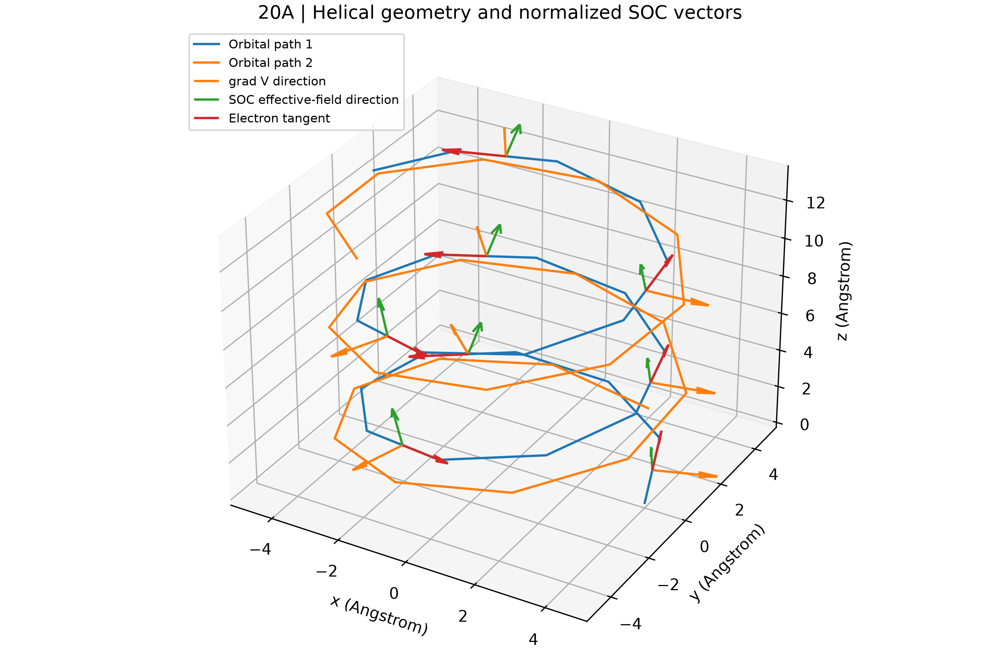
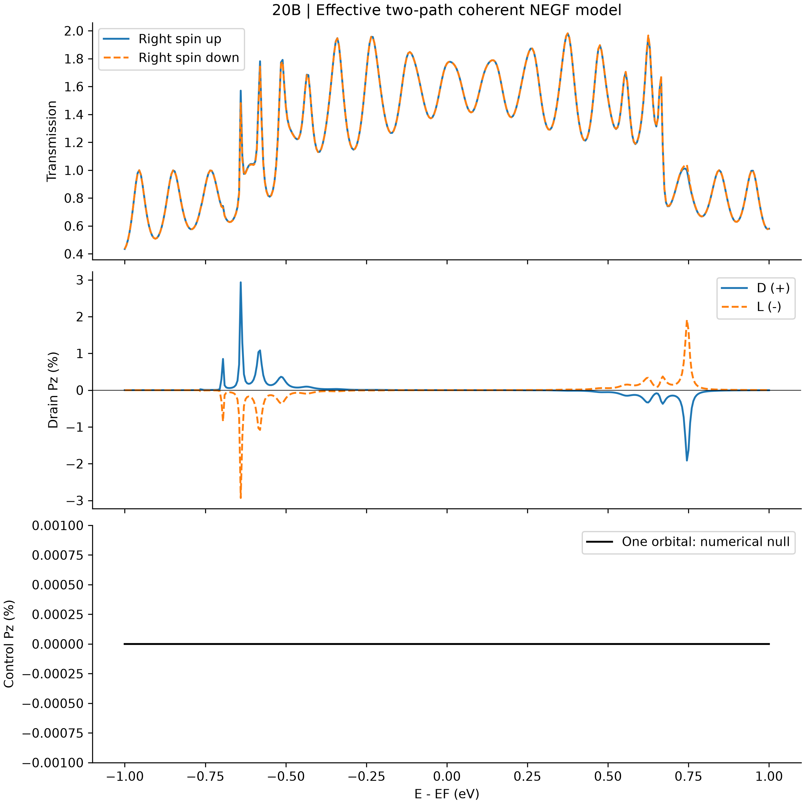
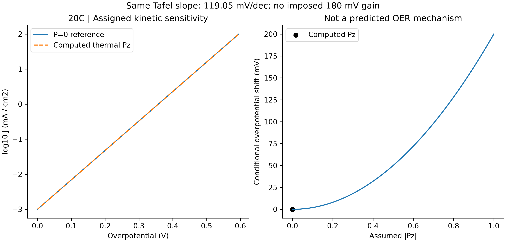
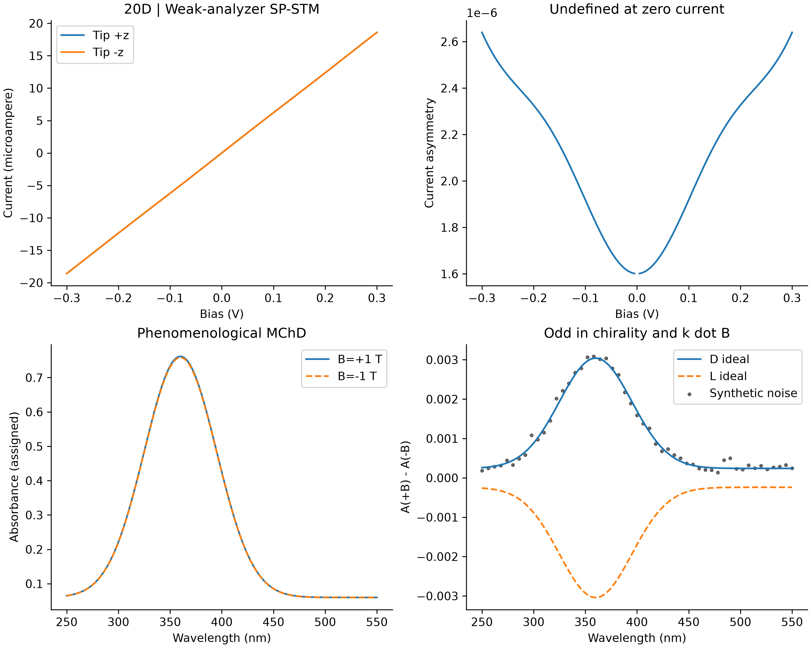

# 第二十阶段：CISS 量子输运、催化敏感性与分析信号仿真

## 范围与结论边界

本阶段是有效模型计算基准。下表数值由脚本实际计算；不把近乎完美的自旋过滤、
180 mV 过电位下降或真实实验验证作为预设结论。单轨道相干输运是必须通过的零极化对照；
双轨道模型是明确增加的物理自由度，不通过隐蔽的自旋吸收项制造极化。

## 20A：螺旋结构与自旋轨道耦合

使用 r(phi)=(R cos(chi phi), R sin(chi phi), p phi)，chi=±1，p=每圈螺距/(2 pi)。
每个纵向格点含两个带自旋的轨道路径；相邻格点跃迁为 -t I+i lambda n·sigma，
n 由径向静电势梯度方向与电子运动切向叉乘得到，反向块取厄米共轭，实数横向跃迁连接两条路径。
主模型是 4×4 分块的稀疏块三对角矩阵。几何单位为埃，能量统一使用 eV。

这是 Pauli/Rashba 型有效紧束缚模型，10–50 meV 耦合为指定参数，代表未显式计算的
原子及界面 SOC。没有从实际势场、有效质量或光速推导该数值，也没有独立加入体相
Dresselhaus 耦合。图中的有效场箭头仅表示方向，不是以特斯拉计量的真实磁场。
本模型不属于四分量相对论从头算；固定跃迁时改变格点数也不等同于连续方程网格收敛。

## 20B：NEGF、自旋透射与对称性

左右电极为非磁性半无限链，各轨道和自旋通道相同。用满足推迟边界条件的表面格林函数
计算自能 Sigma=t_contact² g 和展宽 Gamma=-2 Im Sigma；稀疏 LU 只求接触所需列，
不显式求整个稠密逆矩阵。微小 eta 是数值正则项，不代表退相干、非弹性散射或漏电浴。

透射矩阵采用右端出射、左端入射的指标约定；T_up/down 对全部入射自旋及轨道求和。
由出射密度矩阵 tt† 计算三个方向的极化，极低透射时将极化标为未定义。
单轨道、非磁性、双端相干系统在时间反演和幺正约束下不能仅靠自旋进动产生净过滤。
增加轨道路径允许自旋与轨道纠缠及路径干涉，但不保证高极化。

分别重建 D/L 哈密顿量并独立计算。采用 y→-y 的镜像时，自旋作为轴矢量满足
(Px,Py,Pz)→(-Px,Py,-Pz)：沿电流方向的 Pz 反号，整个矢量并非无条件反号。
脚本验证 H_L=U H_D U†（U=I⊗sigma_y）、纵向极化反号和总透射不变。
电极和输运方向固定，因此不将翻转电流或电极磁化混同于手性翻转。

## 20C：OER 条件性动力学敏感性

先用费米分布导数加权，求热自旋流与热电荷流之比。再指定交换电流、转移系数 alpha
和能垒响应参数 gain，使用 log10 j=log10 j0+[alpha eta+gain Pz²]/(kBT ln10)。
由此得到的过电位变化 gain Pz²/alpha 是模型条件性结果，不是计算出的 OER 反应能垒。
alpha 保持不变，两条 Tafel 曲线斜率相同；脚本不强制生成斜率下降或至少 180 mV 的改善。
附图另给假定极化大小的敏感性扫描，并与实际输运计算点明确区分。
低过电位部分只是阳极 Tafel 支的外推，不是完整 Butler–Volmer 净电流；横轴为过电位，
不冒充含平衡电位的绝对电极电压。

OER 涉及多个催化剂相关中间体，三重态氧的存在不能证明所有损失都源于自旋翻转。
本阶段未计算吸附自由能、过渡态或 ROS 生成，也不能证明单重态氧被完全禁止。
已有实验研究支持继续探索自旋与 OER 的联系，但并不为这里的任意螺旋模型提供校准。

## 20D：分析信号与生物学展望

SP-STM 使用弱磁针尖分析器，将 (T±p_tip(T_up-T_down))/2 代入有限温度 Landauer 积分。
针尖反转不反馈修改哈密顿量，未包含有限偏压下电势重排或磁性接触反作用；
零电流处电流不对称度为未定义，而不是人为置为可观测信号。
MChD 是独立的经验吸收模型 A_chi(B)=A0(1+chi c k_hat·B)，系数为指定值，
理想信号对手性、磁场、光传播方向分别反号。高斯噪声固定随机种子并标为合成噪声。
光学跃迁没有从输运哈密顿量求出，所有图均为计算或仿真信号，不能视为实测验证。

生物分子的手性使电子转移中的自旋效应值得研究，但本脚本没有线粒体蛋白、氧中间体、
ROS 动力学或生物实验。不能据此声称生命利用 CISS 防止氧化损伤。
面向清洁能源的自旋催化仍需独立电化学、结构及自旋测量，并结合催化机制建模。

## 验证与后续工作

运行时检查厄米性、时间反演、镜像关系、无 SOC 及单轨道对照、透射非负与通道上限、
稀疏求解和稠密参考一致性、概率守恒、eta 减小十倍的敏感性，并计算能量网格加密后的
热极化变化。失败时停止输出，实际残差与容差写入 JSON。验证证明的是模型内部一致性，
不等于真实材料精度、通用 CISS 理论或工业成熟度。
后续可研究界面参数标定、非弹性输运与 OER 微观动力学；本阶段不宣称重新验证了其他阶段。

## Numerical record / 数值记录

| Quantity / 项目 | Value / 数值 |
|---|---:|
| Sites / 格点数 | 24 |
| Orbital paths / 轨道通道数 | 2 |
| SOC (meV) | 30 |
| Energy window / 能窗 | -1 to +1 eV |
| Energy points / 能量点数 | 401 |
| Sampled maximum absolute Pz (%) / 采样点最大纵向极化绝对值 | 2.9322505 |
| Thermal Pz (%) / 热加权纵向极化 | 0.00040010451 |
| Single-channel max absolute P (%) / 单通道极化残差 | 4.6228663e-13 |
| Conditional OER shift (mV) / 条件性过电位变化 | 3.2016723e-09 |
| Tafel slope, both (mV/dec) / 两条曲线共同斜率 | 119.05286 |
| Coarse/fine thermal Pz difference / 能网格加密差值 | 2.9151274e-15 |

## Reproduction / 复现

```bash
python -m pip install -r requirements_phase20.txt
python run_phase20_ciss_quantum_spintronics.py --self-test
python run_phase20_ciss_quantum_spintronics.py --output-dir .
```

SOC scan / SOC 参数扫描：`--soc-mev 10`, `--soc-mev 30`, `--soc-mev 50`.
Use separate `--output-dir` paths for scans / 扫描时使用独立输出目录。
Only numpy, scipy, matplotlib are required / 仅需这三个第三方依赖。
Run from any directory; default output is beside the script / 默认输出位于脚本目录。

## Artifacts / 产物

- `results_phase20/summary.json`: parameters, calculated values, environment and validation tolerances.
- `results_phase20/transport.csv`: D/L spin transmission, polarization vectors and one-path control.
- `results_phase20/helix.csv`: geometry and normalized gradient, tangent and SOC directions.
- `results_phase20/oer.csv`: conditional kinetic curves, not measured currents.
- `results_phase20/oer_sensitivity.csv`: assigned polarization scan for the second OER panel.
- `results_phase20/spstm.csv`, `results_phase20/mchd.csv`: simulated analytical signals.
- `results_phase20/sha256.json`: generated-file checksums and script checksum.
- Four PNG figures in `figures_phase20/`, 300 DPI, generated from the exported arrays.






## References / 参考文献

- [Varela et al., one-dimensional Rashba transport and the coherent null control](https://arxiv.org/abs/2301.02156)
- [Evers et al., Theory of Chirality Induced Spin Selectivity: Progress and Challenges](https://arxiv.org/abs/2108.09998)
- [Spin polarization and OER in a monolayer chiral COF model catalyst (2025)](https://doi.org/10.1021/jacs.5c09729)
