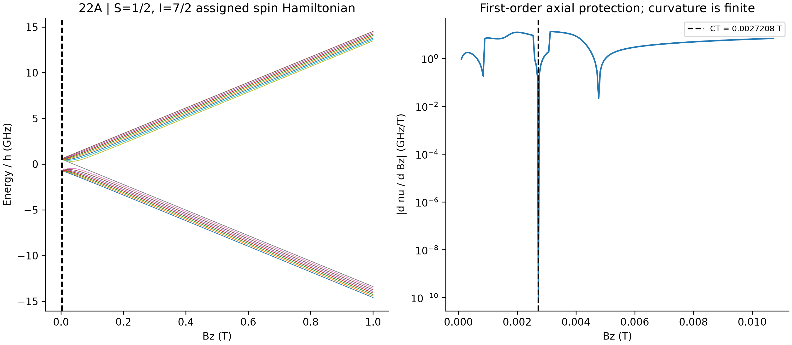
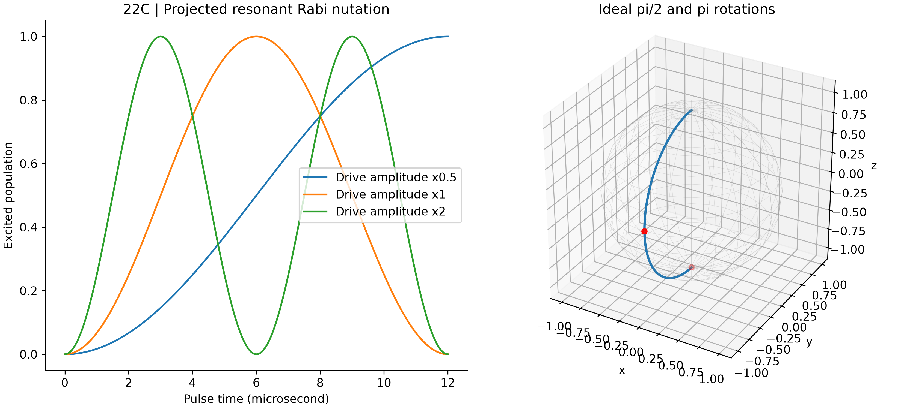
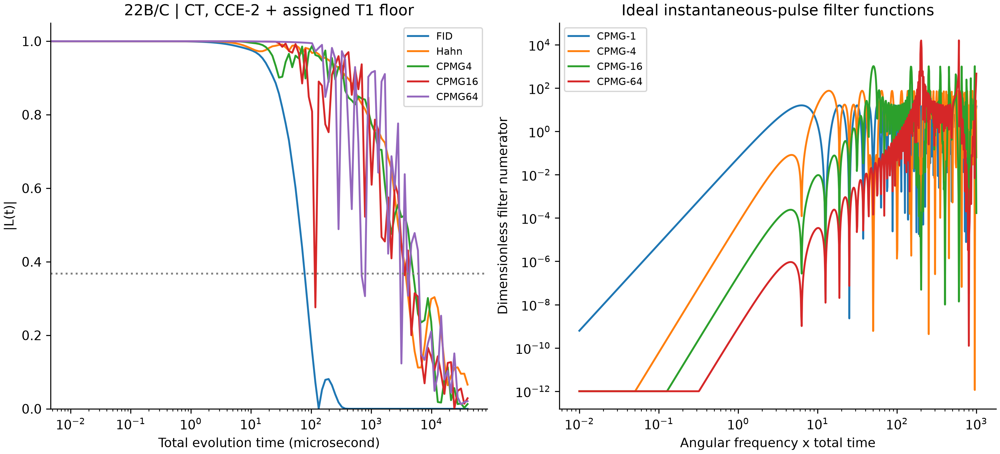
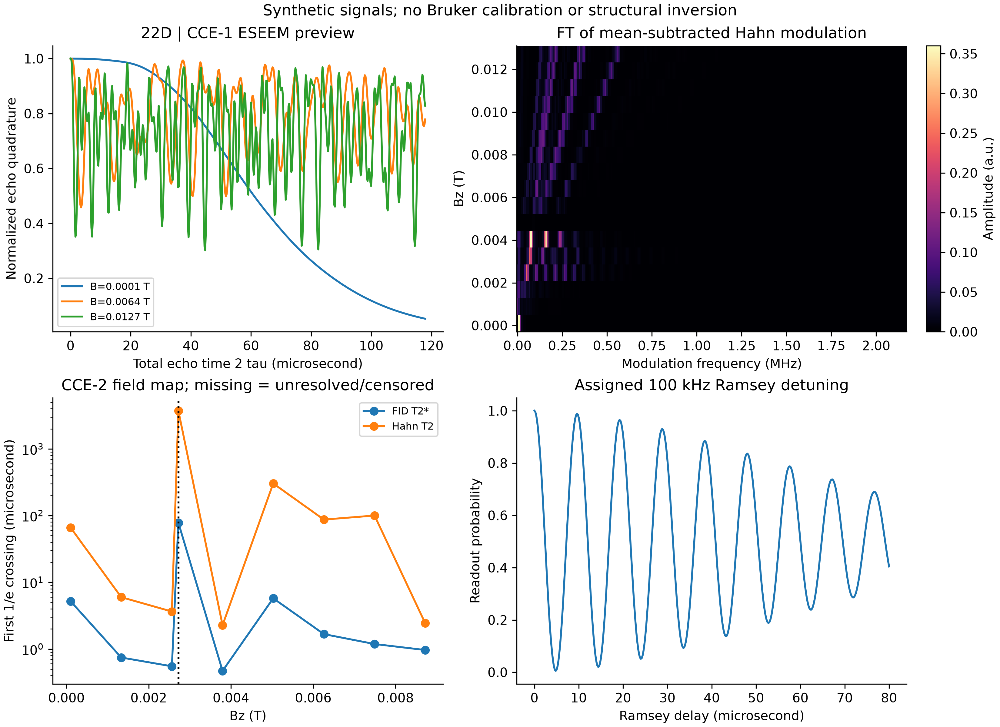

# 第二十二阶段：分子自旋量子比特、时钟跃迁与动力学解耦

## 模型范围

采用指定参数的 S=1/2、I=7/2 配位化合物有效模型，不是已拟合的钒或镧系分子。
包含电子/核塞曼项、各向异性超精细与核四极矩张量，统一用 Hz。
程序支持 ZFS 项，但 S=1/2 没有真正的无迹零场劈裂，所以 D 取零。
稀疏 Kronecker 构造中心自旋算符，小维度矩阵采用厄米对角化。
扫描 0 至 1 T，通过 Hellmann-Feynman 导数找根，再以微波矩阵元筛选可驱动跃迁。
二阶导数包含其他中心能级的虚跃迁，并与有限差分核验。

## 时钟保护的含义

CT 的 dnu/dBz=0 只消除纵向磁场的一阶灵敏度，二阶曲率通常非零。
不能据此声称对所有磁噪声、应变、超精细噪声、电子翻转或声子免疫。
所选两能级是较不敏感的工作点，不是严格无退相干子空间，也没有实现量子纠错编码。
场扫描采用按能量排序的绝热本征态，不是跨场非绝热脉冲追踪。

## 核浴与 CCE

固定随机种子，在 3.5 至 12 埃球壳内按体积均匀放置 30 个质子，最近间距 2 埃。
坐标为合成环境，不是真实晶格。保留完整核偶极张量、非长期近似项和质子塞曼作用，
显式区分角频率与 Hz。用中心能级的 E_a(B+beta)=E_a+E'_a beta+E''_a beta²/2
形成两组条件核浴哈密顿量。beta 为质子的纵向偶极场算符；二阶交叉项保留于成对簇中，
避免在 CT 人为把所有退相干关闭。模型仅处理有效纵向场和纯退相干，不含完整中心自旋翻转。

高核自旋温度下初态为最大混合态，每个单核和双核簇进行精确条件传播，
L_C=Tr(U1†U0)/dim；CCE-2 用单簇乘积和 L_ij/(L_i L_j) 的不可约成对关联组合结果。
它保留有限记忆演化，但不是精确的 30 核全密度矩阵：后者有 2^60 个复数元素，
complex128 约需 18.4 EB 内存。提供 CCE-1 对比和三核精确参考，不能据此宣称
30 核在 CT 附近已经达到高阶收敛；未包含簇外均场和更高阶簇。
分母过小或截断导致 |L| 超出物理范围时标记后续无效，不通过裁剪掩盖失败。

另加入独立的指定准静态技术磁噪声（20 微特斯拉 rms），FID 使用包含曲率的解析高斯平均，
理想平衡回波抵消该静态项。所有曲线另乘指定 T1=10 ms 对应的 exp(-t/2T1)。
这不是计算或测量所得的自旋声子弛豫时间，也不是从核浴中拟合出来的参数。

## 驱动、解耦和寿命

由实际所选 Sx 矩阵元计算投影旋波模型的 Rabi 频率与 π 脉冲时间。
用高斯求积平均失谐及 0.5% 幅度噪声，通过 (|Tr(Utarget†U)|²+2)/6 计算平均门保真度。
未计入向其他分子能级泄漏和脉冲期间核浴演化，因此不是可直接用于实验的门精度。
Bloch 球为理想二能级旋转，不预设保真度必须超过 99.9%。

CPMG 和 UDD 均实现 1、4、16、64 个理想瞬时 π 脉冲，通过条件哈密顿量交替传播，
CPMG 重复块用矩阵整数幂加速，UDD 非等间隔逐段相乘。导出滤波函数，但不以
滤波示意曲线替代核浴动力学；其作用不是一个绝对 Nyquist 截止频率。
有限脉宽、累计控制误差和硬件带宽未纳入 DD，单门脉宽单独报告。

寿命定义为有限时间网格的首次 1/e 交点，允许非指数衰减与复苏。
超出观测窗记为右删失，CCE 失效记为未确定，不虚构 T2。
只有在同一场和同一噪声配置下 FID 与 CPMG-64 均有可确定交点，才报告增益；
不强制得到超过两数量级延长。

## EPR 信号与化学展望

相干寿命随磁场图使用 CCE-2；较密集 ESEEM 光谱图明确采用 CCE-1，包含条件核进动，
不含该图中的成对核关联。Hahn 信号去均值、乘 Hann 窗后进行实 FFT；频率共轭变量
是总回波时间 2tau，不是未经验证的同位素或配位结构鉴定。
归一化回波正交分量为 Re L，换算成电子 Sy 单位需乘投影读出矩阵元。
Ramsey 的 100 kHz 失谐为指定设置。未模拟 Bruker 仪器响应或使用真实 EPR 测量。

配位化学可调控分子组成和配体，但不保证晶体/溶剂环境完全一致，不能断言这些能力
是半导体缺陷体系无法实现的。氘代减小旋磁比，却引入 I=1 四极矩核；12C 富集可减少
13C 核自旋，其他核、声子和无序仍存在。这些是实验设计方向，不是本脚本已完成的
材料优化，也不是室温分子量子处理器的证据。参考实验仅用于研究背景。

## Computed values / 计算结果

- Selected CT / 选定时钟跃迁: **0.0027208157 T**, states 3 and 11 (ascending energies).
- Transition / 跃迁频率: **1.18649392 GHz**.
- Axial slope / 轴向一阶导数: **0 Hz/T**.
- Curvature / 二阶导数: **6.78178e+12 Hz/T²**.
- pi pulse / π 脉冲: **6.002730 microseconds**.
- Projected noisy gate fidelity / 投影含噪声门保真度: **99.943046%**.
- CPMG-64/FID crossing ratio / 阈值交点增益: **8.85831669775934** (null = not resolvable).

| Sequence / 序列 | Lifetime (seconds) / 寿命 | Status / 状态 |
|---|---:|---|
| FID | 7.822288533831443e-05 | crossing |
| Hahn | 0.00373053789404695 | crossing |
| CPMG1 | 0.00373053789404695 | crossing |
| CPMG4 | 0.004996799101433063 | crossing |
| CPMG16 | 0.00011541593097462193 | crossing |
| CPMG64 | 0.0006929230913393051 | crossing |
| UDD1 | 0.003730537894047006 | crossing |
| UDD4 | 0.004882192833990317 | crossing |
| UDD16 | 0.0034304853590400933 | crossing |
| UDD64 | 0.000365455700450016 | crossing |

## Reproduction / 复现

```bash
python -m pip install -r requirements_phase22.txt
python run_phase22_molecular_spin_qubits.py --self-test
python run_phase22_molecular_spin_qubits.py
```

All parameters and numerical checks are in `results_phase22/summary.json`.
CSV files contain the bath geometry, CT candidates, field levels, full complex
coherences (including UDD-1/4/16/64), filter functions, ESEEM and lifetime statuses.
`sha256.json` records output and script hashes. Figures are 300 DPI.
The default run uses a fixed seed and only numpy, scipy and matplotlib.






## References / 参考文献

- [Shiddiq et al. (2016), Enhancing coherence in molecular spin qubits via atomic clock transitions](https://doi.org/10.1038/nature16984)
- [Yang and Liu, finite-spin-bath cluster-correlation expansion](https://arxiv.org/abs/0806.0098)
- [Yang and Liu, ensemble CCE dynamics](https://arxiv.org/abs/0902.3055)
- [Cluster-correlation expansion for studying decoherence of clock transitions in spin baths](https://arxiv.org/abs/2007.00412)
