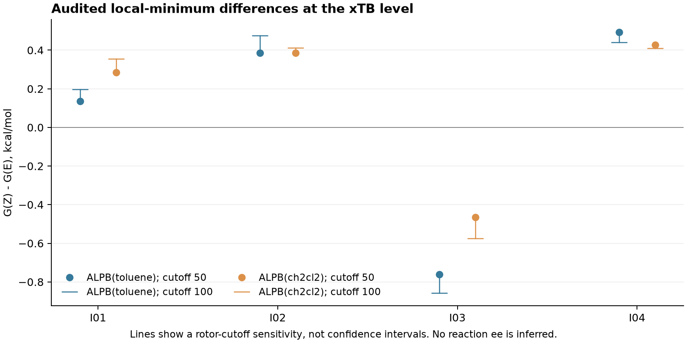
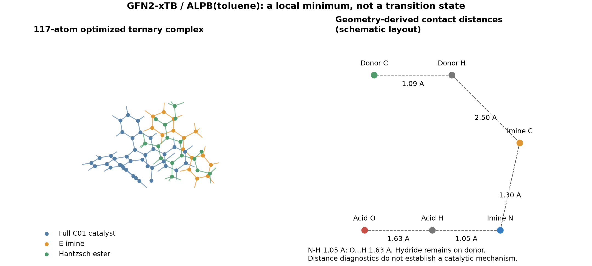

# Phase25 — 本地计算推进与证据复核

**快照时间：2026-09-10T16:10:30.622155+00:00。科学任务仍未通过整体验收，选择性未判定。** 本报告承接初版提交 `93b9ab1`，新增真实优化、频率、完整三组分结构及本地 DFT 在途计算。Phase26/27 本轮没有新增生产级计算。

## 已完成与仍在运行的工作

- 已记录 **33 个 xTB 作业**，包括对照和未通过的候选结构；其中 **25 个**通过该近似层级的局部极小点筛查。程序正常退出不等于结构验收通过。
- 构建 8 个 **117 原子**完整 C01 磷酸—亚胺—二甲酯型 Hantzsch 酯起点，覆盖 E/Z、两侧进攻方向及每组合两个起点；当前 **7 个**完整复合物通过 xTB 检查。没有截断催化剂。face 的正负只是起点方向，不代表 R/S 产物。
- I01-E 的 **PBE-D3BJ/def2-SVP 气相优化已收敛**，耗时 19.76 分钟；能量为 **-594.909268679091 Eh**，最大及均方根笛卡尔梯度分别为 **4.534e-06**、**1.407e-06 Eh/bohr**，E 构型保持。优化收敛尚不等于通过频率验证。
- 同势能面的完整 DFT 数值 Hessian 已在公开冻结快照中保留 **41/163 个已完成梯度作业**。**尚不报告完整 DFT 频率或 DFT 自由能。** 在途文件不进入发布哈希清单，完成后需单独审核。
- 历史 4 条孤立亚胺 DFT 单点保留。当前本地队列接续 E 的 Hessian，再依次运行 Z 优化、Z 频率，以及在 PBE 优化的 E/Z 几何上的 ωB97X-D 单点。排队项目不计作完成。

## 快照中的 DFT 作业状态

| Job | Method | Stage | Status | Energy (Eh) | Final E/Z geometry |
|---|---|---|---|---:|---|
|pbe_E_freq_01|pbe-d3bj|freq|FAILED|pending|not assessed|
|pbe_E_freq_02|pbe-d3bj|freq|STARTED|pending|not assessed|
|pbe_E_opt_01|pbe-d3bj|opt|OPTIMIZED_FREQUENCY_PENDING|-594.909268679091|E|
|pbe_Z_opt_01|pbe-d3bj|opt|OPTIMIZED_FREQUENCY_PENDING|-594.905102976489|Z|

E、Z 两套优化均已收敛，Z 几何保持；Z 的最大梯度为 3.661e-06 Eh/bohr，耗时 26.54 分钟。气相 PBE-D3BJ 的电子能 E(Z)−E(E) 为 2.614 kcal/mol；它不是自由能差或催化势垒。与下方溶剂化 xTB 表格比较时，方法和环境同时不同，不能把差异直接归因于泛函。

空闲内存回升后，已额外启动 Z 优化；队列会接管或跳过同一作业，避免重复计算。频率行中的 STARTED/FAILED 均不代表已得到通过验收的频率结果。

## 方法与验收规则

使用 xTB 6.7.1、GFN2-xTB、ALPB（甲苯/二氯甲烷）、总电荷 0、未配对电子数 0、accuracy=0.2；常规优化使用 vtight，虚频修正使用 extreme。优化与 Hessian 的方法和溶剂保持一致；先确认优化收敛，再执行 `--hess --strict`。原始命令、日志、几何和 Hessian 均保留。[官方频率说明](https://xtb-docs.readthedocs.io/en/latest/hessian.html)

独立解析器要求 3N 个完整模式、重复打印块一致、6 个平移/转动模式已投影，以及全部内部模式高于 1 cm⁻¹；另检查原子顺序、孤立亚胺 E/Z、完整复合物的轴手性几何符号与重原子连接距离。1 cm⁻¹ 是数值筛查阈值，并非已证明的频率误差界限。该筛查也不能替代经过化学审阅的 DFT 驻点和 IRC。

初始 I02-E 在两种溶剂中均出现虚频。xTB 的热化学汇总默认使用 −20 cm⁻¹ 截断，可能在原始模式为负时仍显示“0 个虚频”。我们按原始模式拒绝这些结构，沿引擎给出的虚频方向正、负两侧重优化，保留成功替代结构和失败记录。全部负频候选：**imine_dcm_repair_01/I02_E_dcm_plus: -31.66 cm^-1, imine_repair_01/I02_E_plus: -10.27 cm^-1, imines_dcm_01/I02_E: -23.21 cm^-1, imines_toluene_01/I02_E: -18.26 cm^-1, ternary_toluene_01/C01_I01_Z_face+1_start0: -4.88 cm^-1**。没有对负频取绝对值后冒充极小点。列表中带负频的三组分候选仍未解决，已从通过筛查的候选表中排除；亚胺的修正结果不构成该三组分结构的验收。

## 溶剂与低频处理的实算结果

下表单位为 kcal/mol，是**有限搜索中单个局部极小点的 xTB 层级 G(Z)−G(E)**。按 G50 选择各 E/Z 已通过筛查的候选。它不是构象系综、活化势垒、真实 E/Z 布居或反应 ee；同组成的一对一比较中共同标准态常数抵消，尚不认证绝对 1 M 溶液自由能或结合自由能。

| Imine | Solvent | G(Z)-G(E), cutoff 50 | G(Z)-G(E), cutoff 100 |
|---|---|---:|---:|
|I01|ALPB(toluene)|0.135|0.198|
|I02|ALPB(toluene)|0.386|0.475|
|I03|ALPB(toluene)|-0.761|-0.857|
|I04|ALPB(toluene)|0.493|0.441|
|I01|ALPB(ch2cl2)|0.285|0.355|
|I02|ALPB(ch2cl2)|0.386|0.413|
|I03|ALPB(ch2cl2)|-0.466|-0.575|
|I04|ALPB(ch2cl2)|0.428|0.410|

50/100 cm⁻¹ 对照由 **xTB 原生 thermo** 重用已保存的真实 Hessian 完成，保留其依赖分子几何的转动惯量。原 50 cm⁻¹ 热化学校正重放 **25/25** 在 1e-6 Eh 内一致。图中连线是处理方法的敏感性，**不是置信区间**；表格没有使用固定转动惯量近似。依据：[参数说明](https://github.com/grimme-lab/xtb/blob/v6.7.1/man/xcontrol.7.adoc)、[热化学实现](https://github.com/grimme-lab/xtb/blob/v6.7.1/src/thermo.f90)、[ALPB 标准态定义](https://xtb-docs.readthedocs.io/en/latest/gbsa.html#reference-states)。本轮保留并注明默认 gsolv 参照。

## 完整体系与镜像对照

| Start | Final E/Z | Proton contact state | Relative G50 (kcal/mol) | Lowest mode (cm^-1) |
|---|---|---|---:|---:|
|E_face-1_start0|E|N_bound_candidate|0.000|12.14|
|E_face-1_start1|E|N_bound_candidate|2.189|6.64|
|E_face+1_start0|E|O_bound_candidate|6.231|6.27|
|E_face+1_start1|E|N_bound_candidate|4.287|5.41|
|Z_face-1_start0|Z|O_bound_candidate|7.083|7.65|
|Z_face-1_start1|Z|N_bound_candidate|4.035|8.78|
|Z_face+1_start1|Z|O_bound_candidate|19.963|7.46|

相对 G50 以本轮有限集合中最低已通过候选为零点。**这些是复合物极小点，不是竞争过渡态，不能代入 R/S 选择性公式。** 固定原子对应的重原子 RMSD 已保存；搜索次数不当作物理简并度，没有人为赋予系综权重。催化剂绝对轴手性和产物 CIP 认证仍未完成。

以 E_face-1_start0 为例：O···H=1.629 Å、N−H=1.048 Å，指定供氢位点的 C−H 仍为 1.094 Å。在此近似层级，它是未完成氢转移的亚胺鎓—磷酸根离子对候选；其他起点也得到 O 端结合的中性氢键候选。因此后续 DFT 搜索必须区分质子化状态，但这些结果尚不能确证实验机制。对完整结构作精确镜像后，同几何 xTB 单点能差在打印精度下为 **0.000e+00 kcal/mol**。这只检验能量的镜像对称性，不等于验证产物 ee 符号翻转。非手性和无催化剂的速率对照尚未完成。

## 算力、失败恢复和未完成项

使用现有 CPU 环境；已完成的 DFT 优化申请 500 MB、2 线程，Hessian/队列申请 500 MB、3 线程，xTB 使用 1 线程。申请值不是峰值内存保证。已结束 xTB 作业累计记录 **4318.9 核秒**（墙钟时间×分配线程数），含未通过的候选；不含仍在运行的作业，也不冒充等成本主动学习比较。

首轮 DFT 频率在一个梯度完成后，因 Windows GBK 解码 UTF-8 原始输出失败；失败日志已保留。使用 `python -X utf8` 修复接口问题，没有修改安装的量化引擎。现在逐点绑定 QCSchema 输入与成功结果的哈希，保存可复用检查点；另用真实微型梯度作业验证首次计算、精确重放和损坏检查点拒绝。公开快照只包含已完成且已核查的数据。本地有限队列需要电脑及进程保持运行；不会自动购买算力、调用 OpenAI 推理 GPU 或自动发布，也不保证后续收敛。

仍缺完整 DFT R/S 过渡态及 IRC、关键结构的相关波函数复核、显式溶剂自由能独立重复、Curtin–Hammett 时间尺度验证和真正外部盲测标签。因此不报告速率、转化率、有符号 ee、区间覆盖率或 0.5 kcal/mol 系综收敛通过。Phase26 的恒电位采样及 Phase27 的多参考非绝热动力学仍待执行。

## 数据入口

[计算进展](results_phase25_27/phase25/pilot_progress.json) · [原始 xTB 作业](results_phase25_27/phase25/xtb_pilot) · [独立频率核查](results_phase25_27/phase25/xtb_pilot/validation.json) · [三组分诊断](results_phase25_27/phase25/ternary_diagnostics.json) · [原生热化学对照](results_phase25_27/phase25/thermo_sensitivity/results.json) · [DFT 优化](results_phase25_27/phase25/stationary_pilot/pbe_E_opt_01/result.json) · [梯度冻结快照](results_phase25_27/phase25/hessian_checkpoint_snapshot/manifest.json) · [本地运行快照](results_phase25_27/phase25/local_execution_snapshot.json) · [发布排除项](results_phase25_27/publication_omissions.json) · [复现说明](phase25_27/README.md)。
