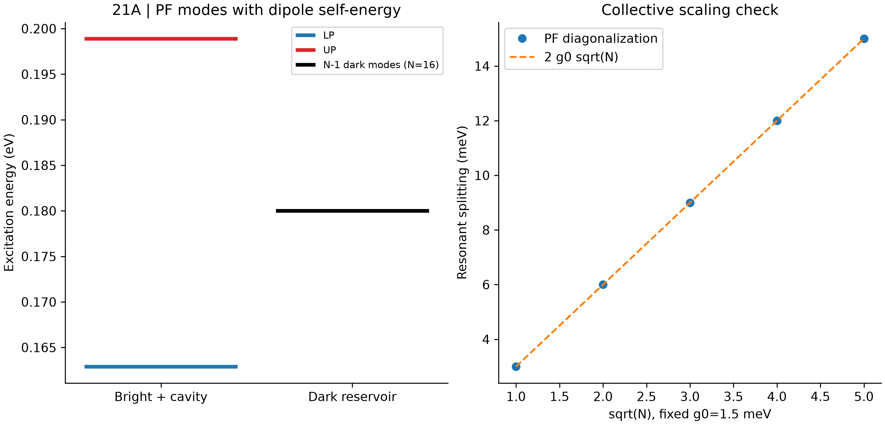
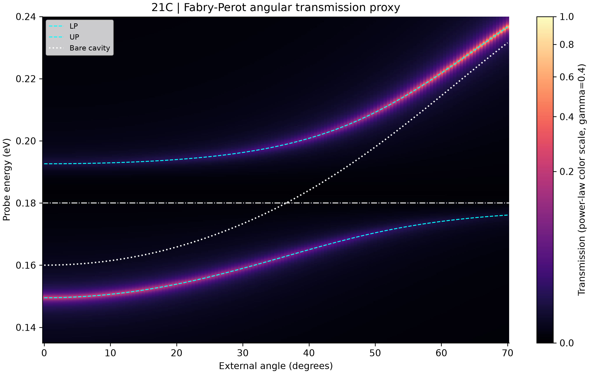
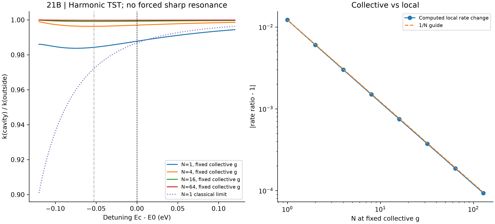
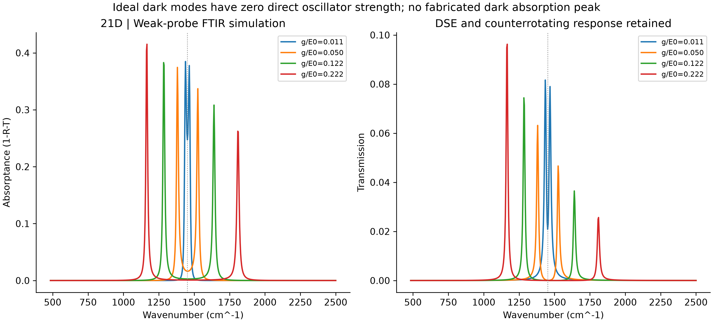

# 第二十一阶段：腔量子电动力学与极化激元化学

## 范围

使用指定参数的谐振 Pauli-Fierz 有效模型，研究集体光谱劈裂、暗态和局部反应瓶颈。
2.012 eV 对称四次势仅借用此前骨架反应能垒的量级，不是从 Phase 4/5 重新提取的真实势能面，
也没有拟合实际分子的偶极函数。平衡真空场计算没有外部泵浦；测量 FTIR 则需要弱探测光。
两者并不矛盾，本阶段没有实测光谱或化学反应数据。

## 21A：哈密顿量与数值基组

使用能量单位，H=sum E0(b_i†b_i+1/2)+Ec(a†a+1/2)
+g0(a+a†)sum(b_i+b_i†)+(g0²/Ec)[sum(b_i+b_i†)]²。
完整保留反旋转项和不同分子间的偶极自能交叉项。平方坐标算符直接投影，避免先截断再平方
造成最高能级边界项丢失。光子占据数为 0 至 3，振动占据数为 0 至 4。
N=2 的完整张量积对角化用于验证；大量相同谐振分子则精确约化为耦合强度 g=g0 sqrt(N)
的亮振子和 N-1 个暗振子。额外采用 12 个光子态、14 个振动态检验亮态基组收敛。
完整二次型正常模提供不依赖旋波近似的参照，并在共振条件、固定 g0 时检验 sqrt(N) 劈裂。
g0=lambda mu01 sqrt(Ec/2) 说明有效参数的物理含义；未指定真实腔体积和跃迁偶极，
因此不推断绝对真空场强，也不声称材料层面的从头算精度。

## 21B：局部反应与速率

势能面 V(q)=B[1-(q/q0)²]²，通过有效质量使势阱振动能量为 E0，
同一势对应的虚频绝对值为 E0/sqrt(2)。光子势为 1/2[Ec Q+sum a_i q_i]²，
a_i=2g0 sqrt(E0/Ec)，采用质量加权坐标。对 Q 极小化后恢复原始分子势能面；
省略自能才会产生虚假的静态势垒变化甚至失稳。导出的二维势能面是 N=1 的示意切片。

过渡态仅改变一个分子的曲率，其余保持势阱状态。剔除唯一不稳定模后计算谐振量子 TST：
k=(kBT/h) exp(-B/kBT) prod_min[2sinh(Ek/2kBT)]/prod_TS_stable[2sinh(Ek/2kBT)]。
零点能已包含在振子配分函数中，不另加一次零点能垒修正。
即使弛豫后的经典势垒不变，稳定模自由能和正常模分割面的变化仍可改变这个模型的速率。
其经典极限速率比等于耦合后不稳定频率与裸势垒频率之比。
扫描同时覆盖势阱实频与势垒虚频绝对值，不人为乘上共振峰函数。
此模型不保证在分子基频处出现尖锐抑制，也不包含隧穿、溶剂摩擦、真实反应轨迹或量子再穿越。
尤其在较高势垒下，绝对速率仅是谐振 TST 的示意估计。

局部稀释扫描固定集体 g，因此单分子 g0=g/sqrt(N)。光场耦合的是总偶极，
而单个断键坐标在亮态中的参与权重为 1/N。这解释本模型中的集体与局部差异，
不等于解决所有实验体系的集体反应问题。固定 g0 的劈裂扫描与固定 g 的稀释扫描
改变的是不同参数；扫腔频时也固定 g，不视为固定真实腔体积的实验。

## 21C/D：光谱与仪器代理模型

反演 K-E²I-i E diag(gamma,kappa) 得到被动双端口光学响应，保留自能及反旋转项，
包括 g/E0>0.1 的扫描。默认 Q=200，kappa=Ec/Q，分子线宽 gamma=3 meV。
使用对称端口，同时输出透射 T、反射 R 和真实吸收率 A=1-R-T，检验能量守恒。
劈裂大于所用线宽之和是本基准的分辨判据，不冒充唯一强耦合定义；
光谱阻尼为经验模型，不是超强耦合微观热浴主方程。

角度色散采用 Ec(theta)=Ec(0)/sqrt(1-sin²(theta)/n_eff²)，
属于 Fabry-Perot 腔角分辨代理模型，未计算真实 ATR 棱镜、多层薄膜或完整传输矩阵。
相同分子理想暗态没有直接光腔振子强度：在能级图计数暗态，但不伪造 FTIR 暗态峰。
要使暗态可见，需要无序、直接分子照明或其他对称性破缺机制及对应仪器建模。

## 解释与验证

本阶段说明边界条件在有效模型中可以改变混合正常模与平衡涨落，但光谱反交叉本身
不证明化学反应速率改变。测试覆盖 Fock 收敛、sqrt(N)、暗态简并、自能稳定性、
弛豫势能面抵消、经典行列式、零耦合速率恢复及光谱被动性。
实际残差和容差写入 JSON；这些检查验证程序与模型内部一致性，不能取代真实分子
非谐性、偶极标定、耗散反应动力学和重复实验。保留既有阶段，不宣称重新验证此前结论。

## Computed results / 实际计算结果

| Quantity / 项目 | Value / 数值 |
|---|---:|
| Fundamental / 分子振动能量 (eV) | 0.18 |
| Collective coupling / 集体耦合 (eV) | 0.018 |
| LP / UP (eV) | 0.16289776 / 0.19889776 |
| Rabi splitting / 劈裂 (meV) | 36.000000 |
| gamma + kappa (meV) | 3.900000 |
| Resolved strong coupling / 满足所用线宽判据 | True |
| N=1 resonant quantum rate ratio / 共振处量子速率比 | 0.98780387 |
| N=64 resonant quantum rate ratio / 共振处量子速率比 | 0.99981325 |
| N=1 swept ratio range / 扫描范围 | 0.98375770 to 0.99439723 |
| Truncated Fock mode error / 小基组误差 (eV) | 1.968e-07 |

## Run / 运行

```bash
python -m pip install -r requirements_phase21.txt
python run_phase21_cavity_qed_polaritonic_chemistry.py --self-test
python run_phase21_cavity_qed_polaritonic_chemistry.py --output-dir .
```

`results_phase21/summary.json` includes all assigned parameters, environment versions,
numerical errors and tolerances. CSV files preserve modes, scaling, rate sweeps,
local dilution, the 2D PES, FTIR and the angle-resolved transmission grid.
`results_phase21/sha256.json` records generated file and script checksums.
Only numpy, scipy and matplotlib are required. No network calls occur during a run.






## References / 参考文献

- [Li, Mandal and Huo: Cavity frequency-dependent theory for vibrational polariton chemistry](https://doi.org/10.1038/s41467-021-21610-9)
- [Wang, Flick and Yelin: Chemical reactivity under collective vibrational strong coupling](https://arxiv.org/abs/2206.08937)
- [Lindoy, Mandal and Reichman: Investigating the collective nature of cavity-modified chemical kinetics](https://doi.org/10.1515/nanoph-2024-0026)
