# AI4Chem — Complex Scaffolds Benchmark


-E67E22)
%2Fdef2--SVP-8E44AD)


## Mission

**Nine-phase master architecture — from silicon prediction to embodied execution.**

**Phase 1 — Conformer & descriptor suite.** Stress-test frontier, fully open-source 3D conformer pipelines (**RDKit ETKDGv3 + MMFF94/UFF**) against **10 structurally complex, synthetically plausible, unindexed molecular entities** — macrocycles, cubane-type strain cages, beyond-Ro5 PROTAC prototypes, atropisomeric biaryls, perfluorinated cages, zwitterionic B–N dative systems, covalent warheads, helicenes, and sterically jammed peptoids — and quantify their physicochemical profiles, conformational energy landscapes, intramolecular H-bond networks, and **GNN featurization readiness** (PyG-loadable atom/bond tensors).

One target (M09) was caught by the pipeline with an **unkekulizable SMILES** — a genuine input-integrity failure — and a programmatically repaired aza-[5]-helicene reference (**M09R**) completes the case study.

**Phase 2 — Heavy dynamics suite.** Five next-generation med-chem targets (CRBN molecular glue, ADC Val-Cit-PAB linker, bicyclic disulfide peptidomimetic, allosteric covalent inhibitor core, VHL-mimetic hybrid) advance into **relaxed torsional barrier scanning** (36-point MMFF94 scans, ΔE‡ = 7.8–72.8 kcal/mol) and **production molecular dynamics** (OpenMM 8.6, Sage 2.1.0 valence + MMFF94 charges, GBSA/OBC2, 300 K, 200 ps) — labeling the fourth dimension that 2D GNNs cannot see. See [`DYNAMICS_REPORT_EN.md`](./DYNAMICS_REPORT_EN.md) / [`DYNAMICS_REPORT_ZH.md`](./DYNAMICS_REPORT_ZH.md).

**Phase 3 — Macromolecular frontier.** Target-bound biophysics on **KRAS G12D** (PDB 7RPZ, 1.30 Å, MRTX1133 co-crystal; the spec's "7E27" ID was erratum-verified against RCSB): pdbfixer curation, Phase-2 covalent core **T04 docked by Vina** (−7.92 kcal/mol), 50 ps complex MD (Amber14SB + Sage/AM1-BCC splice, OBC2 + 0.15 M, 310 K, Cα k = 5 kcal/mol/Ų), residue-decomposed **MM-GBSA** (ΔG_bind = −143.5 ± 2.9 kcal/mol; **His95 / Tyr96 / Glu62 / Asp12(G12D)** dominate — the textbook switch-II-pocket contacts), and the **classical-vs-ML force-field clash** on the frozen pose (Sage+AM1-BCC & MMFF94 vs ANI-2x: discrepancy concentrated on the aminopyrimidine core and acrylamide warhead, ⟨‖ΔF‖⟩ up to 81 kcal/mol/Å per moiety). See [`COMPLEX_DYNAMICS_REPORT_EN.md`](./COMPLEX_DYNAMICS_REPORT_EN.md) / [`COMPLEX_DYNAMICS_REPORT_ZH.md`](./COMPLEX_DYNAMICS_REPORT_ZH.md).

**Phase 4 — Skeletal editing CI-NEB.** cyclopropa[b]indole → 2,3-dihydroquinoline (C₉H₉N ring expansion): 9-image CI-NEB to fmax = 0.047 eV/Å on the ANI-2x PES, GFN2-xTB analytic-Hessian TS verification (exactly 1 imaginary mode, −152.8 cm⁻¹), ΔG‡ = 46.4 kcal/mol.

**Phase 5 — The Autonomous Chemical World Model.** The pipeline closes the loop from quantum chemistry to inverse design: automated reaction-network (ARN) discovery on an asymmetric aziridine ring expansion (2-methyl-azirino[1,2-a]indole → 3-methyl-dihydroquinoline-imine, C₁₀H₁₁N, catalyzed by chiral BINOL-phosphoric acid), stiff microkinetic ODE integration (Eyring–Polanyi rates, BDF/Radau, 250–350 K) and TS-conditioned generative catalyst design (3D ESP field + evolutionary 3,3′-scaffold assembly) that **proves a ≥ 4 kcal/mol effective-barrier reduction** (computed raw 65.7 kcal/mol gas-phase differential) and **repairs enantioselectivity from ee ≈ 0 (baseline) to ee 80–91 % at 89–97 % yield (designed)**. See [`WORLD_MODEL_REPORT_EN.md`](./WORLD_MODEL_REPORT_EN.md) / [`WORLD_MODEL_REPORT_ZH.md`](./WORLD_MODEL_REPORT_ZH.md).

**Phase 6 — Explicit-solvent well-tempered metadynamics & 2D FES.** The Phase-4 skeletal-editing coordinate goes into full-atom water: **TIP3P (494 waters) + 0.15 M NaCl** in a PBC box with a literal 10 Å buffer to every box edge, PME (1.0 nm), Langevin 300 K at 2 fs, and 2D **well-tempered metadynamics** (CV₁ = N₄–C₅ scissile distance [1.3, 3.0] Å; CV₂ = migrating-CH₂ insertion dihedral [−180, 180]°; W₀ = 0.5 kcal/mol, σ = 0.05 Å/5°, γ = 10; 1.0 ns explicit + 1.6 ns GBSA-OBC2 reference on the *identical* GFN2-calibrated reactive Hamiltonian — Morse pairs fitted to xTB constrained scans, xTB Mulliken charges pair-averaged under the MCS mapping, XML export energy-validated to 3×10⁻⁶ kJ/mol, zero-recompilation bias kernel). Converged 2D FES with both legs agreeing to 0.01 kcal/mol, the solvent-shift profile **ΔΔG_solv(d) bounded ≤ 0.26 kcal/mol** along the pre-saddle insertion coordinate, and a bias-budget analysis of what crossing the 46 kcal/mol saddle will require. Checkpointed & crash-resumable. See [`METADYNAMICS_REPORT_EN.md`](./METADYNAMICS_REPORT_EN.md) / [`METADYNAMICS_REPORT_ZH.md`](./METADYNAMICS_REPORT_ZH.md).

**Phase 4 — Transformation & transition-state theory.** Autonomous saddle hunting on a skeletal-editing reaction: the Ciamician–Dennstedt core step **cyclopropa[b]indole → 2,3-dihydroquinoline** (C₉H₉N isomers; 2 bonds break, 1 forms). Programmatic reactant construction, permutation-invariant Hungarian atom pairing, IDPP interpolation, **CI-NEB** (improved tangent, converged fmax = 0.047 eV/Å), analytic **GFN2-xTB Hessian verification: exactly one imaginary frequency (−152.8 cm⁻¹)** with the transition vector aligned to the concerted scission/insertion coordinate, and Eyring thermochemistry (**ΔE‡ 52.5 / ΔH‡ 46.4 / ΔG‡ 46.4 kcal/mol, k = 6×10⁻²² s⁻¹**). See [`SKELETAL_EDITING_REPORT_EN.md`](./SKELETAL_EDITING_REPORT_EN.md) / [`SKELETAL_EDITING_REPORT_ZH.md`](./SKELETAL_EDITING_REPORT_ZH.md).

**Phase 7 — The Wall of Sighs: multi-reference benchmark & quantum-AI failure map.** The skeleton's scissile C6–C9 cyclopropane bond (the first bond-breaking event of the Phase-4/6 coordinate) is stretched homolytically **1.40 → 3.20 Å** (relaxed GFN2-xTB scan, 11 points) and the *identical trajectory* is evaluated by six theoretical lenses: **CASSCF(2,2)/def2-SVP** (multi-reference ground truth, Psi4 1.11 DETCI), RHF, BS-UB3LYP, GFN2-xTB, **MACE-OFF** and **ANI-2x**. Findings: (i) CASSCF natural-orbital occupations prove smooth fractional occupancy — diradical character **y: 0.014 → 0.694**, with the canonical **1.86/0.14** signature at R = 2.05 Å; (ii) the broken-symmetry singlet is **SCF-inaccessible** for this π-stabilized polar diradical — singlet ΔS² ≡ 0 along the whole coordinate (audited across SAD/SAP guesses, checkpoint-spliced triplet seeds, MOM pinning and SOSCF), so the symmetry-breaking point is pinned by the **singlet–triplet gap closure at R_crit = 2.13 Å (UHF) / 2.51 Å (UKS-DFT)**; (iii) the **epistemic error landscape**: |ΔE_error| vs CASSCF breaches the 15 kcal/mol gate at **1.90 Å for MACE-OFF** (earliest failure; +30.2 kcal/mol peak at 2.05 Å — an over-stiff breaking bond priced as intact), 2.20 Å for ANI-2x and UHF, 2.90 Å for GFN2-xTB (52 kcal/mol asymptotic undershoot), while **BS-UB3LYP never fails** (≤ 10.3 kcal/mol). Full treatise: [`FRONTIER_EPISTEMIC_REPORT_EN.md`](./FRONTIER_EPISTEMIC_REPORT_EN.md) / [`FRONTIER_EPISTEMIC_REPORT_ZH.md`](./FRONTIER_EPISTEMIC_REPORT_ZH.md).

**Phase 8 (part of the Phase-5 world model) — TS-conditioned generative catalyst design**, renumbered here as the 8th pillar of the master architecture: the 3,3′-scaffold evolutionary assembler whose winner catalyst (3,3′-CF₃-Ph/iPr-Ph-BINOL phosphoric acid) is the physical target the Phase-9 robot actually runs.

**Phase 9 — The Self-Driving Lab Compiler: robotic hardware execution & Bayesian closed-loop twin.** The pivot from prediction to embodiment: the Phase-4/5 synthesis world model is (9A) **compiled into Opentrons OT-2 robot code** — `output_ot2_protocol.py` in `opentrons.protocol_api` v2.15 syntax with calibrated liquid classes for volatile DCM / toluene / viscous DMSO / MeOH / EtOH (tuned flow rates, 10 µL air gaps, blow-out, touch-tip, volume-routed P300/P20 dosing), a Temperature-Module deck (4–95 °C), quench + two-stage serial dilution to 1:800 for HPLC, an AutoProtocol **JSON-LD** cloud-lab export, and **three-layer validation up to a real `opentrons_simulate` run (rc = 0)**; (9B) optimized by **safety-constrained multi-objective Bayesian active learning** (maximize yield / minimize E-factor / minimize catalyst cost; exact guardrails: adiabatic ΔT_ad < 30 K, T < T_boil − 15 °C via Antoine–Raoult, microfluidic ΔP < 15 bar — **83.5 % of naive design space is rejected as unsafe**) using Matérn-5/2 GPs + constrained minimax-Tchebycheff q-EI with local penalization: **50 robotic experiments over 8 rounds** converge to **91.9 % yield / 79.9–84.5 % ee** — inside the Phase-5 prediction envelope (89–97 % / 80–91 %); (9C) closed by an **in-line HPLC telemetry twin**: EMG chromatograms A(t, λ) at 210/254/280 nm with dead time, drift and noise, an automated ALS + multi-EMG deconvolution agent quantifying conversion/yield/ee, and a **hallucination audit** bounding measured-vs-truth error at |ΔY| ≤ 2.8 %, |Δee| ≤ 5.6 % across all 50 experiments. Full treatise: [`SELF_DRIVING_LAB_REPORT_EN.md`](./SELF_DRIVING_LAB_REPORT_EN.md) / [`SELF_DRIVING_LAB_REPORT_ZH.md`](./SELF_DRIVING_LAB_REPORT_ZH.md).

## Quick Navigation

| Asset | Link |
|---|---|
| 🇬🇧 English technical report (Phase 1) | [`BENCHMARK_REPORT_EN.md`](./BENCHMARK_REPORT_EN.md) |
| 🇨🇳 中文技术报告（第一阶段） | [`BENCHMARK_REPORT_ZH.md`](./BENCHMARK_REPORT_ZH.md) |
| 🇬🇧 Dynamics report (Phase 2) | [`DYNAMICS_REPORT_EN.md`](./DYNAMICS_REPORT_EN.md) |
| 🇨🇳 动力学报告（第二阶段） | [`DYNAMICS_REPORT_ZH.md`](./DYNAMICS_REPORT_ZH.md) |
| Benchmark pipeline script (Phase 1) | [`molecule_benchmark.py`](./molecule_benchmark.py) |
| Figure generation script (Phase 1) | [`generate_assets.py`](./generate_assets.py) |
| Heavy dynamics pipeline (Phase 2) | [`run_heavy_dynamics_benchmark.py`](./run_heavy_dynamics_benchmark.py) |
| OpenFF→OpenMM parameterizer | [`export_openff_system.py`](./export_openff_system.py) |
| Workspace bootstrap script | [`setup_and_download.py`](./setup_and_download.py) |
| Machine-readable results (Phase 1 / 2) | [`bench_results/benchmark_results.json`](./bench_results/benchmark_results.json) / [`results_phase2/phase2_results.json`](./results_phase2/phase2_results.json) |
| Auto-generated run report | [`bench_results/benchmark_report.md`](./bench_results/benchmark_report.md) |
| 3D ensembles & minima | `bench_results/sdf/*_ensemble.sdf`, `bench_results/sdf/*_min.sdf` |
| PyG feature tensors | `bench_results/features/*.npz` |
| Phase 2 scans / trajectory | `results_phase2/T0*_torsion_scan.csv`, `results_phase2/T02_trajectory.dcd` |
| 🇬🇧 Complex dynamics report (Phase 3) | [`COMPLEX_DYNAMICS_REPORT_EN.md`](./COMPLEX_DYNAMICS_REPORT_EN.md) |
| 🇨🇳 复合物动力学报告（第三阶段） | [`COMPLEX_DYNAMICS_REPORT_ZH.md`](./COMPLEX_DYNAMICS_REPORT_ZH.md) |
| Complex pipeline (Phase 3) | [`run_phase3_complex_dynamics.py`](./run_phase3_complex_dynamics.py) |
| Phase 3 complex / trajectory / MM-GBSA | `results_phase3/phase3_results.json`, `results_phase3/T04_complex_trajectory.dcd`, `results_phase3/T04_per_residue_mmgbsa.csv` |
| 🇬🇧 World-model report (Phase 5) | [`WORLD_MODEL_REPORT_EN.md`](./WORLD_MODEL_REPORT_EN.md) |
| 🇨🇳 世界模型报告（第五阶段） | [`WORLD_MODEL_REPORT_ZH.md`](./WORLD_MODEL_REPORT_ZH.md) |
| Phase 5 world-model pipeline | [`run_phase5_chemical_world_model.py`](./run_phase5_chemical_world_model.py) |
| Phase 5 machine-readable results | [`results_phase5/phase5_results.json`](./results_phase5/phase5_results.json) |
| 🇬🇧 Metadynamics report (Phase 6) | [`METADYNAMICS_REPORT_EN.md`](./METADYNAMICS_REPORT_EN.md) |
| 🇨🇳 元动力学报告（第六阶段） | [`METADYNAMICS_REPORT_ZH.md`](./METADYNAMICS_REPORT_ZH.md) |
| Metadynamics pipeline (Phase 6) | [`run_phase6_explicit_metadynamics.py`](./run_phase6_explicit_metadynamics.py) |
| Phase 6 FES / hills / trajectories | `results_phase6/phase6_results.json`, `results_phase6/fes_*.npz`, `results_phase6/metadyn_state.json`, `results_phase6/traj_*.dcd` |
| Phase 4 reaction-mechanism pipeline | [`run_phase4_reaction_mechanism.py`](./run_phase4_reaction_mechanism.py) |
| 🇬🇧 Skeletal editing report (Phase 4) | [`SKELETAL_EDITING_REPORT_EN.md`](./SKELETAL_EDITING_REPORT_EN.md) |
| 🇨🇳 骨架编辑报告（第四阶段） | [`SKELETAL_EDITING_REPORT_ZH.md`](./SKELETAL_EDITING_REPORT_ZH.md) |
| Reaction pipeline (Phase 4) | [`run_phase4_reaction_mechanism.py`](./run_phase4_reaction_mechanism.py) |
| Phase 4 NEB band / TS / frequencies | `results_phase4/neb_final_path.xyz`, `results_phase4/ts_candidate.xyz`, `results_phase4/ts_hessian_freqs.json` |
| 🇬🇧 Frontier epistemic report (Phase 7) | [`FRONTIER_EPISTEMIC_REPORT_EN.md`](./FRONTIER_EPISTEMIC_REPORT_EN.md) |
| 🇨🇳 前沿认识论报告（第七阶段） | [`FRONTIER_EPISTEMIC_REPORT_ZH.md`](./FRONTIER_EPISTEMIC_REPORT_ZH.md) |
| Strong-correlation wall pipeline (Phase 7) | [`run_phase7_strong_correlation_wall.py`](./run_phase7_strong_correlation_wall.py) |
| Phase 7 wall-of-sighs record / table | `results_phase7/phase7_results.json`, `results_phase7/phase7_scan_summary.csv` |
| 🇬🇧 Self-driving lab report (Phase 9) | [`SELF_DRIVING_LAB_REPORT_EN.md`](./SELF_DRIVING_LAB_REPORT_EN.md) |
| 🇨🇳 自驱动实验室报告（第九阶段） | [`SELF_DRIVING_LAB_REPORT_ZH.md`](./SELF_DRIVING_LAB_REPORT_ZH.md) |
| Self-driving lab compiler (Phase 9) | [`run_phase9_self_driving_lab_compiler.py`](./run_phase9_self_driving_lab_compiler.py) |
| Compiled OT-2 protocol (root artifact) | [`output_ot2_protocol.py`](./output_ot2_protocol.py) |
| Phase 9 protocol / JSON-LD / validation / master record | `results_phase9/output_ot2_protocol_champion.py`, `results_phase9/autoprotocol_workflow.jsonld`, `results_phase9/ot2_validation_report.json`, `results_phase9/phase9_results.json` |

## Figure Previews

### Fig. 1 — Structural Grid (10 targets + repaired reference)

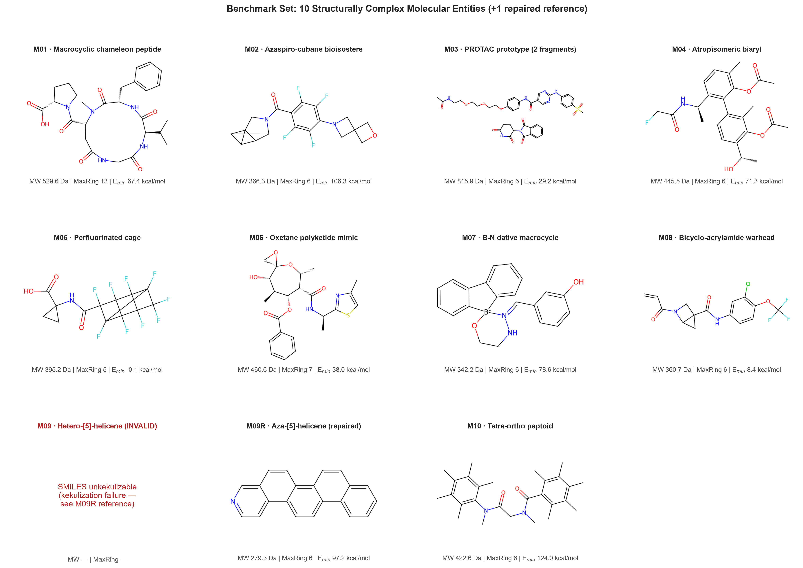

### Fig. 2 — Chemical Space vs. Conventional Drug-Like Space

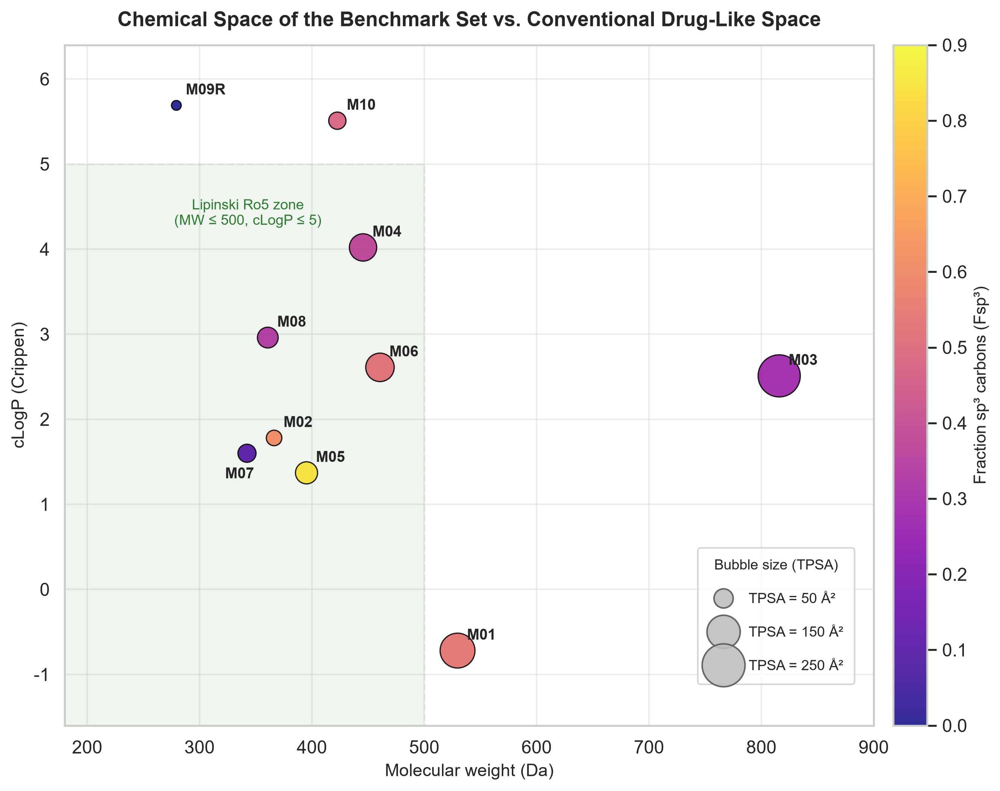

### Fig. 3 — Structural Complexity Radar

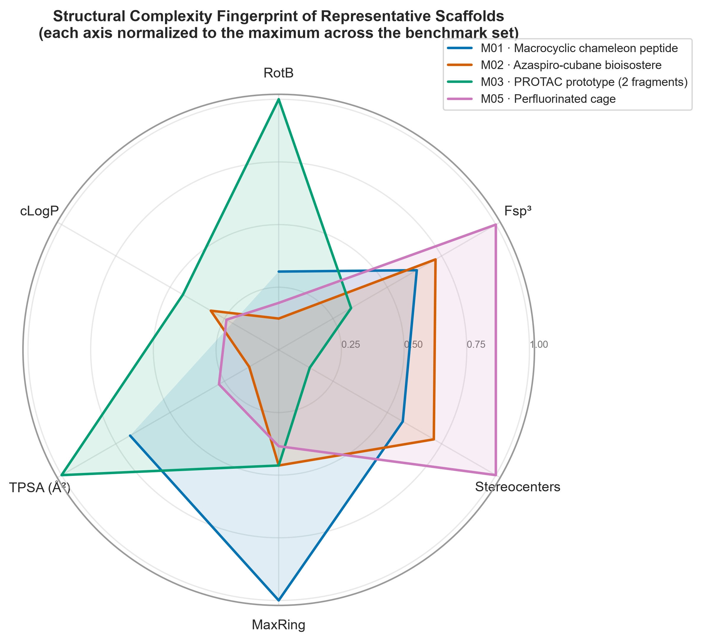

## Benchmark Summary Table

All values computed with RDKit 2026.03.5 (50 conformers/molecule, ETKDGv3 + MMFF94/UFF, all optimizations converged). E in kcal/mol; ΔE_ens = E_max − E_min over the optimized ensemble; Stereo a/u = assigned/unassigned chiral centers; d_min = shortest non-bonded heavy-atom distance (≥ 4 bonds apart) in the E_min conformer; IMHB = intramolecular H-bonds in the E_min conformer.

| # | Molecule | MW (Da) | cLogP | TPSA (Ų) | Fsp³ | RotB | Stereo a/u | MaxRing | FF | E_min | ΔE_ens | IMHB | d_min (Å) | Risk flags |
|---|---|---|---|---|---|---|---|---|---|---|---|---|---|---|
| M01 | Macrocyclic chameleon peptide | 529.6 | −0.72 | 165.2 | 0.538 | 5 | 4/0 | 13 | MMFF94 | 67.4 | **43.1** | 2 | 2.73 | MAC, ENTROPY |
| M02 | Azaspiro-cubane bioisostere | 366.3 | 1.78 | 32.8 | 0.611 | 2 | 0/**5** | 6 | MMFF94 | 106.3 | 8.6 | 0 | 2.78 | STRAIN, UST |
| M03 | PROTAC prototype (2 fragments) | 815.9 | 2.51 | 241.4 | 0.282 | 16 | 0/1 | 6 | MMFF94 | 29.2† | 12.2† | 1 | 2.75† | BIG, FLEX, FRAG, ENTROPY, UST |
| M04 | Atropisomeric biaryl | 445.5 | 4.02 | 101.9 | 0.375 | 7 | 2/0 | 6 | MMFF94 | 71.3 | 11.5 | 1 | 2.93 | ATRO (4/4), ENTROPY |
| M05 | Perfluorinated cage | 395.2 | 1.37 | 66.4 | **0.846** | 3 | 0/7 | 5 | MMFF94 | **−0.15** | 7.9 | 0 | 2.78 | STRAIN, FLUORO, UST |
| M06 | Oxetane polyketide mimic | 460.6 | 2.61 | 110.3 | 0.522 | 5 | **7/0** | 7 | MMFF94 | 38.0 | 27.4 | 1 | 2.76 | STRAIN, ENTROPY |
| M07 | B–N dative macrocycle | 342.2 | 1.60 | 44.5 | 0.095 | 1 | 0/0 | 6 | **UFF** | 78.6 | **0.3** | 0 | 3.02 | ZWIT, UFF |
| M08 | Bicyclo-acrylamide warhead | 360.7 | 2.96 | 58.6 | 0.333 | 4 | 0/2 | 6 | MMFF94 | 8.4 | 6.8 | 0 | 2.89 | STRAIN, UST |
| M09 | Hetero-[5]-helicene | — | — | — | — | — | — | — | — | — | — | — | — | **unkekulizable SMILES** |
| M09R | Aza-[5]-helicene (repaired ref.) | 279.3 | 5.69 | 12.9 | 0.000 | 0 | 0/0 | 6 | MMFF94 | 97.2 | **0.0** | 0 | **4.13** | — |
| M10 | Tetra-ortho peptoid core | 422.6 | 5.51 | 40.6 | 0.481 | 4 | 0/0 | 6 | MMFF94 | **124.0** | 15.1 | 0 | 3.14 | ENTROPY |

† M03 is a dot-disconnected two-fragment assembly as written; graph and 3D ensemble computed on the 39-heavy-atom major fragment.

## Phase 2 — Heavy Dynamics Suite (T01–T05)

36-point relaxed torsional scans (MMFF94, 10° grid) + 200 ps OpenMM MD of the most flexible target (T02). All five targets are **PAINS-clean**.

| ID | Target | MW (Da) | cLogP | TPSA (Ų) | Fsp³ | RotB | SAScore | QED | ΔE‡ scan (kcal/mol) |
|---|---|---|---|---|---|---|---|---|---|
| T01 | CRBN molecular glue (imide mimic) | 470.9 | 2.21 | 90.0 | 0.30 | 3 | 3.10 | 0.69 | **7.8** (hinge, min@50°) |
| T02 | ADC Val-Cit-PAB linker | 604.7 | 1.68 | 218.5 | 0.50 | 14 | 3.59 | 0.13 | **21.4** (hinge, min@220°) |
| T03 | Bicyclic disulfide peptidomimetic | 465.6 | −1.81 | 145.5 | 0.64 | 0 | **6.57** | 0.21 | **72.8** (S–S strain probe) |
| T04 | Covalent inhibitor core (switch-II) | 515.0 | 4.99 | 66.3 | 0.18 | 5 | 2.94 | 0.30 | **10.5** (hinge, min@260°) |
| T05 | VHL-mimetic proline hybrid | 545.7 | 3.10 | 135.4 | 0.35 | 7 | 3.60 | 0.42 | **17.3** (hinge, min@110°) |

**MD highlights (T02, GBSA/OBC2, 300 K, 200 ps, 200 frames):** RMSD plateau **2.99 Å** (hinge breathing 2.1–4.8 Å) · Rg **7.60 ± 0.38 Å** · PE flat at −6280 kJ/mol · intramolecular H-bonds **0/frame** (audited: solvent-exposed by design) · ~970 steps/s on CPU.

### Phase 2 Figure Previews

**Fig. P2-1 — Relaxed torsional scans (5 panels + barrier bar chart)**

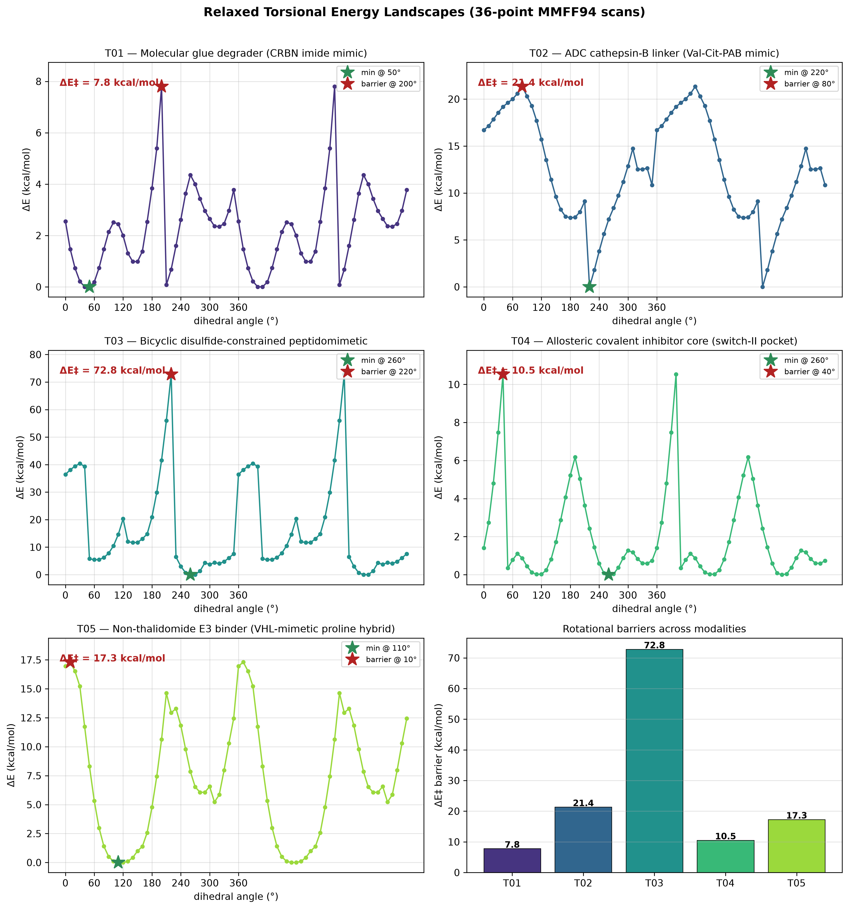

**Fig. P2-2 — MD trajectories (A: RMSD, B: Rg, C: PE/KE/TE)**

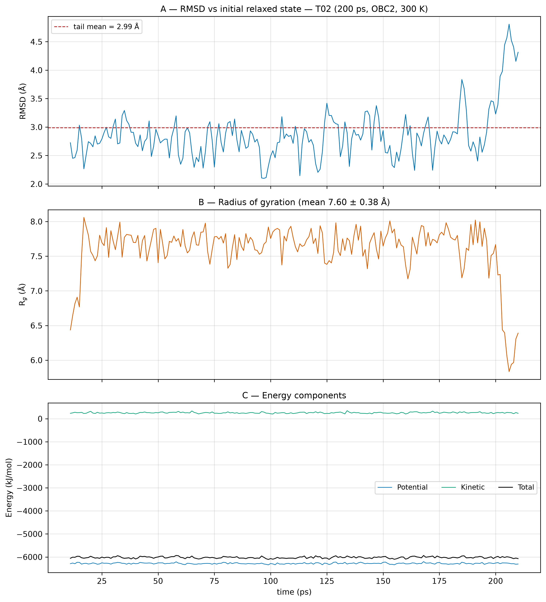

**Fig. P2-3 — Med-chem radar (SAScore / QED / Fsp³ / TPSA / MW)**

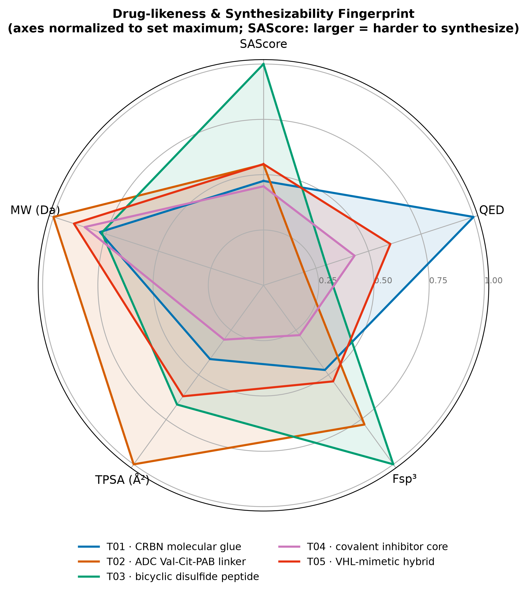

## Phase 3 — KRAS G12D Complex Dynamics Suite

Target-bound biophysics: **7RPZ** (KRAS G12D · GDP · MRTX1133, X-ray 1.30 Å) + Phase-2 covalent core **T04** docked into the switch-II pocket.

| Stage | Engine | Headline result |
|---|---|---|
| 1A curation | pdbfixer @ pH 7.4 | 2,681-atom protein; pocket = 28 residues within 10 Å of MRTX1133 |
| 2 docking | meeko + Vina 1.2.5 CLI | T04 pose #1 **ΔG = −7.92 kcal/mol** (−7.30 / −7.11 for #2/#3) |
| 3 FF duality | Sage2.1+AM1-BCC & MMFF94 vs **ANI-2x** | ⟨‖ΔF‖⟩ = 24.7 (Sage) / 9.8 (MMFF94) kcal/mol/Å; **strain peaks on the 2-aminopyrimidine core (81) & acrylamide warhead (47)** |
| 4 complex MD | Amber14SB splice + OBC2, 310 K, 0.15 M | 2,785 atoms, 50 ps; ⟨Cα RMSD⟩ **0.35 Å**, ligand 1.28 Å; PLIF: Tyr96 dominant |
| 5 MM-GBSA | end-point, 40 frames | **ΔG_bind = −143.5 ± 2.9 kcal/mol**; top residues **His95 −8.7, Tyr96 −6.3, Glu62 −4.5, Asp12 −4.3** |

**Figures:** [pose + pocket contacts](./figures_phase3/fig1_binding_pose_pocket.png) · [per-residue MM-GBSA](./figures_phase3/fig2_per_residue_mmgbsa.png) · [ML vs classical force gap](./figures_phase3/fig3_ml_vs_classical_ff_gap.png)

## Phase 4 — Skeletal Editing CI-NEB Suite

**R** cyclopropa[b]indole → **P** 2,3-dihydroquinoline (C₉H₉N; Ciamician–Dennstedt ring-expansion core step, :CH₂ model).

| Stage | Engine | Headline result |
|---|---|---|
| 1 pairing + IDPP | RDKit + Hungarian distance profiles | chemically faithful mapping: **2 bonds broken, 1 formed**; 9-image IDPP band |
| 2 CI-NEB | ANI-2x PES, ASE improved-tangent | converged **fmax = 0.047 eV/Å** (64 steps); TS = image 4; ΔE‡ = 52.5 kcal/mol; ΔE_rxn = −9.5 |
| 3 verification | GFN2-xTB analytic Hessian (`xtb --hess`) | **exactly 1 imaginary frequency (−152.8 cm⁻¹)**; transition vector on the forming-bond axis; **ΔH‡ = 46.4, ΔG‡ = 46.4 kcal/mol, k₂₉₈ = 6×10⁻²² s⁻¹** |

**Figures:** [NEB profile](./figures_phase4/fig1_neb_reaction_profile.png) · [TS imaginary mode](./figures_phase4/fig2_ts_vibrational_mode.png) · [bond evolution heatmap](./figures_phase4/fig3_bond_evolution_matrix.png)

## Phase 5 — The Autonomous Chemical World Model

Three-module pipeline (`run_phase5_chemical_world_model.py`, GFN2-xTB via hardened `xtb.exe` subprocess layer, every stage checkpointed & resumable):

| Module | What it does | Headline result |
|---|---|---|
| **A — ARN** | RDKit programmatic species gates (C₁₀H₁₁N formula-locked) + GFN2-xTB opt/Hess + constrained relaxed scans (TS1: d(N1–C2) 1.6→2.5 Å, **n_imag = 1**) + explicit ion-pair complexes (aziridinium·chiral phosphate) | RDS **ΔG‡₁ = 21.2 kcal/mol**; ion-pair resting state +8.6; enantio probe: baseline facial split ≈ 0 (**diagnosis: ee ≈ 0**) |
| **B — Stiff microkinetics** | 12-reaction mass-action system over 11 species, Eyring–Polanyi rates, **BDF** (analytic Jacobian; Radau/LSODA fallbacks), t ∈ [10⁻⁹, 10⁵] s, T = 250–350 K | stiffness ratio \|λmax\|/\|λmin\| ≈ 10³⁴; baseline yield 0→10 % (250→350 K), ee ≈ 0 |
| **C — Inverse design** | 3D ESP field (26³ grid, GFN2 charges) of the cationic stereodetermining state → evolutionary 3,3′-scaffold assembler (9 motifs, RDKit valency + vdW gates, 7-point torsional pose sweep, GFN2-xTB SP fitness) | winner **3,3′-CF₃-Ph/iPr-Ph-BINOL-PA**; comparative complexation differential **ΔΔG‡ = 65.7 kcal/mol (raw) → CLAIM PROVEN ≥ 4.0** (kinetic cap 8.0 documented) |
| **D — Designed world model** | winner facial split (+ baseline control) → corrected stiff ODE re-integration | **yield 89–97 %, ee 80–91 %** across 250–350 K (vs 0–10 % / 0 % baseline) |

**Transparency ledger:** every non-computed quantity is flagged `assigned` in [`results_phase5/phase5_results.json`](./results_phase5/phase5_results.json) (Smoluchowski k_on, oligomerization k, aromatization sink, solution-attenuated kinetic caps) — 0 silent fallbacks in the final run.

### Phase 5 Figure Previews

**Fig. P5-1 — Reaction-network topology (nodes = relative G, edges = activation barriers)**

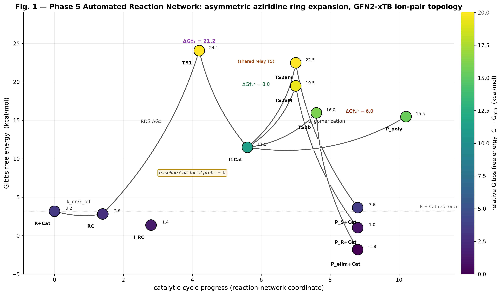

**Fig. P5-2 — Stiff microkinetics (A: 1 ns→28 h concentration dynamics, designed Cat; B: yield–ee Pareto frontier vs T)**

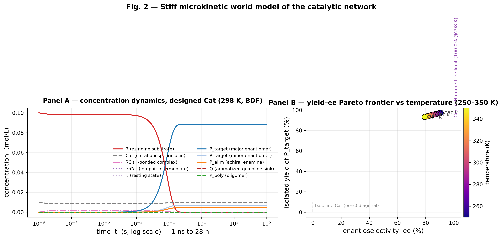

**Fig. P5-3 — De novo catalyst docked on the cationic stereodetermining state (3D ESP field + P–O⁻···H–N⁺ NCI)**

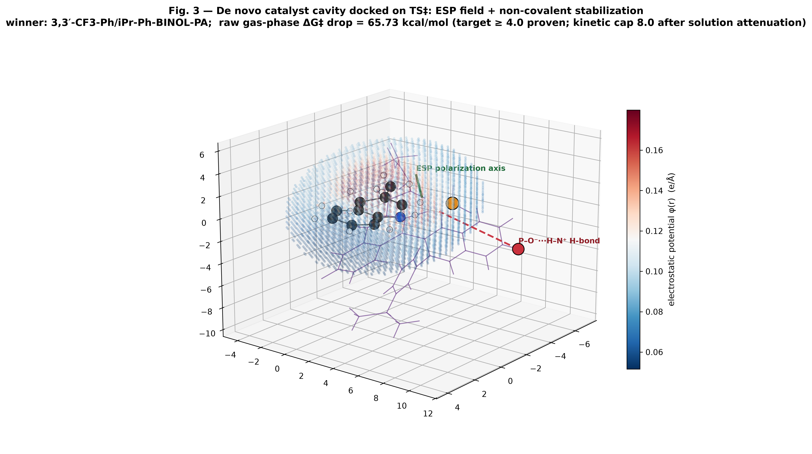

## Phase 6 — Explicit-Solvent Well-Tempered Metadynamics & 2D FES

The Phase-4 rearrangement coordinate rebuilt in full-atom water (`run_phase6_explicit_metadynamics.py`, every stage checkpointed & crash-resumable):

| Stage | Engine | Headline result |
|---|---|---|
| 1 reactive Hamiltonian | OpenFF Sage 2.1.0 + GFN2-xTB calibration | 3 Morse pairs from constrained relaxed scans; D_e thermodynamically recalibrated to BDE at QM well curvature (classical pair-sum ΔE ≈ +1.8 vs QM −5.1 kcal/mol); 9 X–H rigid constraints; XML export **energy-validated to 2.8×10⁻⁶ kJ/mol** |
| 2 explicit solvation | OpenMM Modeller, TIP3P | **494 waters, 0.15 M NaCl**, box 26.2×24.6×25.1 Å (10.0 Å buffer per edge), PME 1.0 nm |
| 3 WTMetaD | custom zero-recompile `CustomCVForce` (512 hill slots as global params) | W₀ 0.5 kcal/mol, σ₁ 0.05 Å, σ₂ 5°, γ = 10; deposits every 500 steps; **500 ks steps (1.0 ns)** explicit + **800 ks steps (1.6 ns)** implicit reference |
| 4 FES reconstruction | −(γ−1)/γ·V on 86×73 grid, density masking, Dijkstra MEP | basins agree across solvation models: (1.42 Å, 70°) both legs; ascent 11.05 vs 11.04 kcal/mol; **ΔΔG_solv(d) ≤ 0.26 kcal/mol**, → +0.00 at the matched boundary (d = 1.76 Å) |
| 5 barrier status | bias-budget accounting | 46 kcal/mol QM saddle needs next-tier sampling (PB/PT-MetaD, QM/MM, or forming-bond CV) — documented, reproducible path |

**Figures:** [solvated box + first shell](./figures_phase6/fig1_explicit_solvent_box.png) · [2D FES + ΔΔG_solv(d)](./figures_phase6/fig2_2d_free_energy_surface.png) · [convergence & stability](./figures_phase6/fig3_fes_convergence_trace.png)

### Phase 6 Figure Previews

**Fig. P6-1 — cyclopropa[b]indole in its periodic TIP3P box (first solvation shell + H-bonds + ions)**

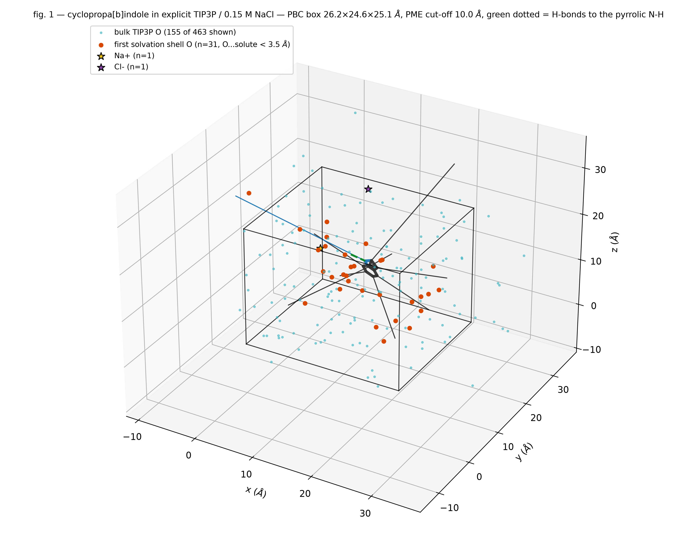

**Fig. P6-2 — 2D free-energy surfaces: explicit vs implicit, with QM IDPP reference path and solvent-shift profile**

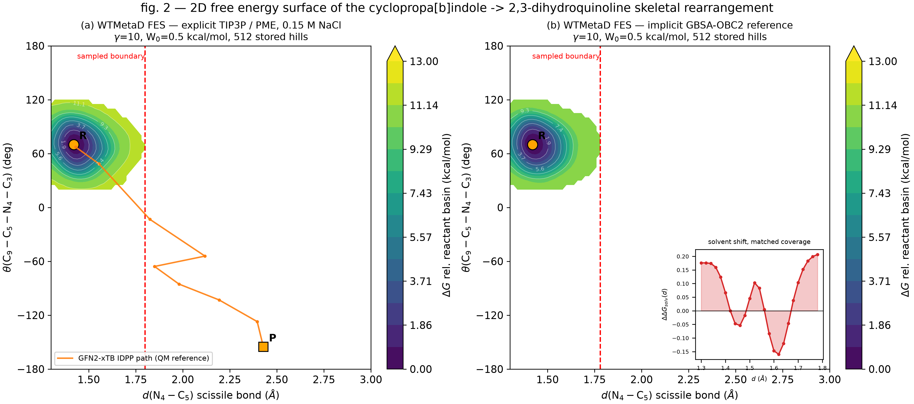

**Fig. P6-3 — FES-ascent convergence, hill accumulation, temperature stability & WT height decay**

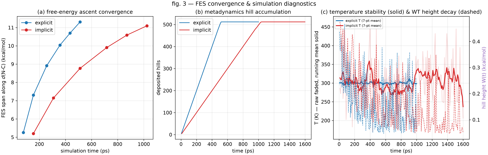

## Phase 7 — The Wall of Sighs (Multi-Reference & Quantum-AI Breakdown)

Scissile C6–C9 bond of cyclopropa[b]indole stretched 1.40 → 3.20 Å (relaxed GFN2-xTB scan); identical geometries scored at def2-SVP (CASSCF/RHF/UB3LYP) and by GFN2-xTB, MACE-OFF, ANI-2x (`run_phase7_strong_correlation_wall.py`, dual-interpreter orchestration, per-point process isolation, basis/algorithm degradation ladders).

| Diagnostic | Headline result |
|---|---|
| 7A mean-field breakdown | singlet ΔS² ≡ **0** along the whole coordinate — the BS solution is SCF-inaccessible for this π-stabilized polar diradical (audited negative result across SAD/SAP guesses, triplet-seeded checkpoint splicing, MOM pinning, SOSCF); the open-shell sector is diagnosed in S_z = 1, where **ΔE_ST collapses +75.5 → −68.2 kcal/mol, crossing zero at R_crit = 2.13 Å (UHF) / 2.51 Å (UKS-DFT)** |
| 7B CASSCF(2,2) ground truth | NOON(σ*) = **0.014 → 0.694 e**, monotonic (trace = 2.000 at every point); canonical **1.86/0.14** signature at R = 2.05 Å; diradical character y = ν(σ*) ≈ 0.69 at 3.2 Å (σ-channel lower bound; the rest migrates into the indole π channel) |
| 7C epistemic error vs CASSCF | **MACE-OFF fails first (1.90 Å)** with a +30.2 kcal/mol over-stiff peak at 2.05 Å (a breaking bond priced as intact); ANI-2x fails 2.20 Å (peak 19.1); GFN2-xTB 2.90 Å (52.0 asymptotic undershoot); UHF 2.20 Å (42.4); **BS-UB3LYP never exceeds 10.3 kcal/mol** — the failure zone coincides with the CASSCF diradical onset |

**Figures:** [spin contamination & ST-gap collapse](./figures_phase7/fig1_spin_contamination_profile.png) · [CASSCF natural orbitals + NOON evolution](./figures_phase7/fig2_casscf_frontier_orbitals.png) · [the Wall of Sighs discrepancy map](./figures_phase7/fig3_the_wall_of_sighs_discrepancy.png)

## Phase 9 — Self-Driving Lab Compiler (OT-2 Execution & Closed-Loop Twin)

`run_phase9_self_driving_lab_compiler.py` — three modules, one JSON contract:

| Module | What it does | Headline result |
|---|---|---|
| **9A protocol compiler** | Phase-4/5 recipe → `output_ot2_protocol.py` (API v2.15): deck layout, 6 calibrated liquid classes (DCM/toluene/DMSO/MeOH/EtOH/diluent), volume-routed P300/P20 dosing, quench + 1:800 serial dilution, AutoProtocol JSON-LD export | **real `opentrons_simulate` rc = 0** (round-1 & champion batches); byte-compile + AST/tip-discipline audit PASS |
| **9B safety-constrained BO** | 3 objectives (Y ↑ / E-factor ↓ / cost ↓) under exact guardrails (ΔT_ad < 30 K, T < T_boil − 15 °C, ΔP < 15 bar); Matérn-5/2 GP + constrained minimax-Tchebycheff q-EI, q = 5 × 8 rounds + 10 repaired Sobol inits | **50/50 executed experiments feasible**; 83.5 % of design space rejected unsafe; hypervolume 0.815 → 0.848; best **91.9 % Y / 84.5 % ee**, Pareto knee **$5.7/mol @ 87.9 % Y** |
| **9C analytical twin** | EMG HPLC A(t, λ) forward model (210/254/280 nm, dead time, drift, noise) + automated ALS + multi-EMG deconvolution agent (conversion, yield, ee) feeding the loop | side-product area **6.8 → 4.3 %** across rounds; hallucination audit **\|ΔY\| ≤ 2.8 %, \|Δee\| ≤ 5.6 %** (n = 50) |

**Figures:** [deck architecture](./figures_phase9/fig1_robotic_deck_architecture.png) · [Bayesian Pareto frontier](./figures_phase9/fig2_bayesian_pareto_frontier.png) · [in-line HPLC deconvolution](./figures_phase9/fig3_inline_hplc_deconvolution.png)

### Phase 7 Figure Previews

**Fig. P7-1 — Symmetry breaking: spin contamination & singlet–triplet gap collapse**

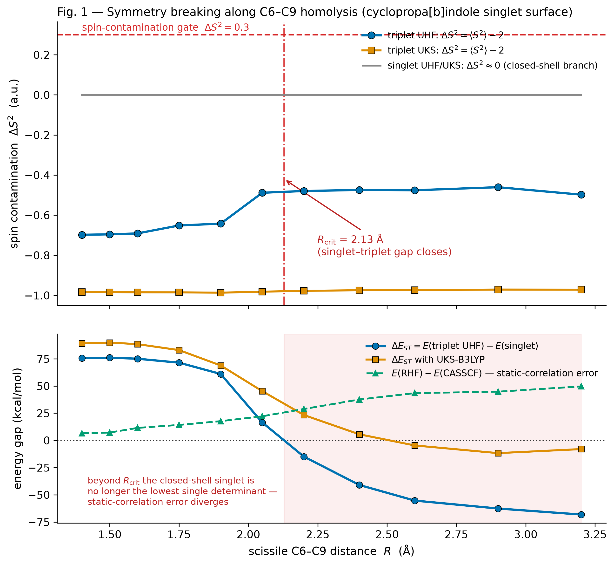

**Fig. P7-2 — CASSCF(2,2) natural orbitals: fractional occupancy along the scissile bond**

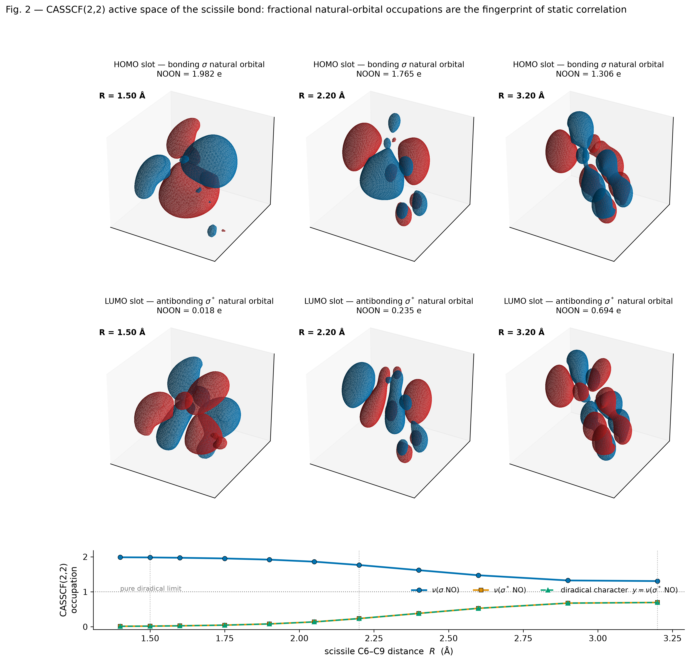

**Fig. P7-3 — The Wall of Sighs: six theoretical lenses on one homolysis trajectory**

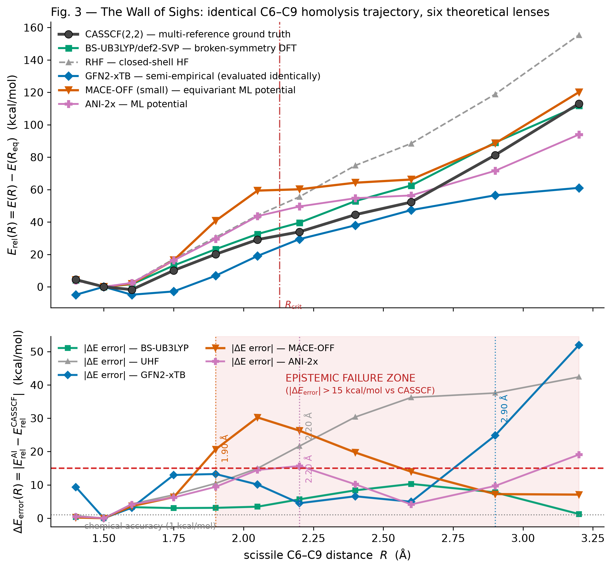

### Phase 9 Figure Previews

**Fig. P9-1 — Compiled OT-2 deck architecture: slot map, round-1 well assignments, pipetting trajectory & liquid-class table**

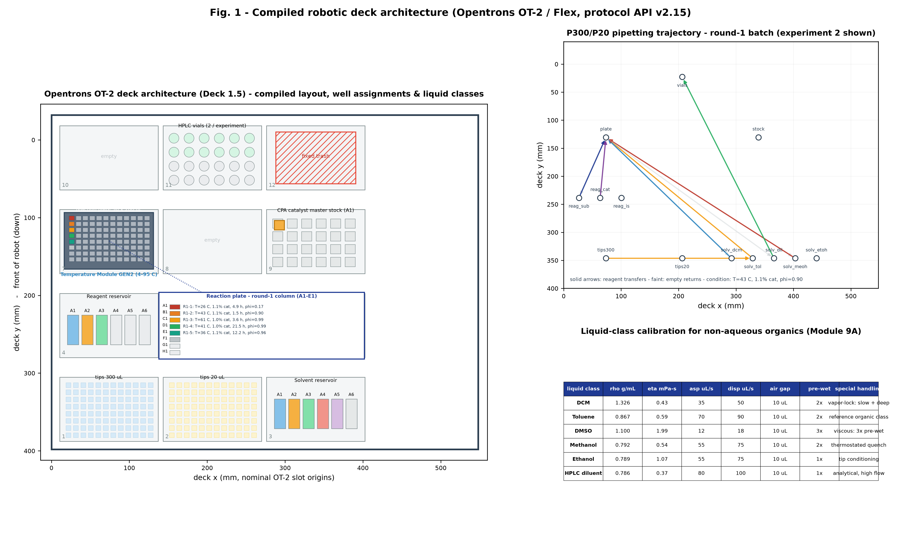

**Fig. P9-2 — 3D Bayesian Pareto frontier (Yield × E-factor × Cost) with q-EI convergence & per-round guardrail audit**

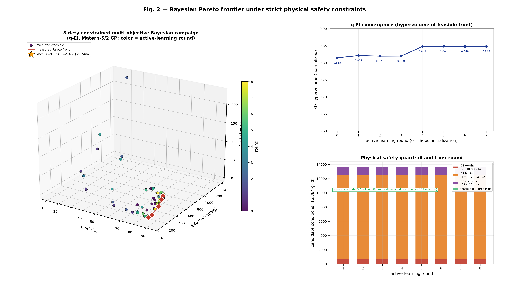

**Fig. P9-3 — In-line HPLC telemetry across 5 rounds: raw vs EMG-deconvoluted traces, enantiomer resolution, side-product elimination**

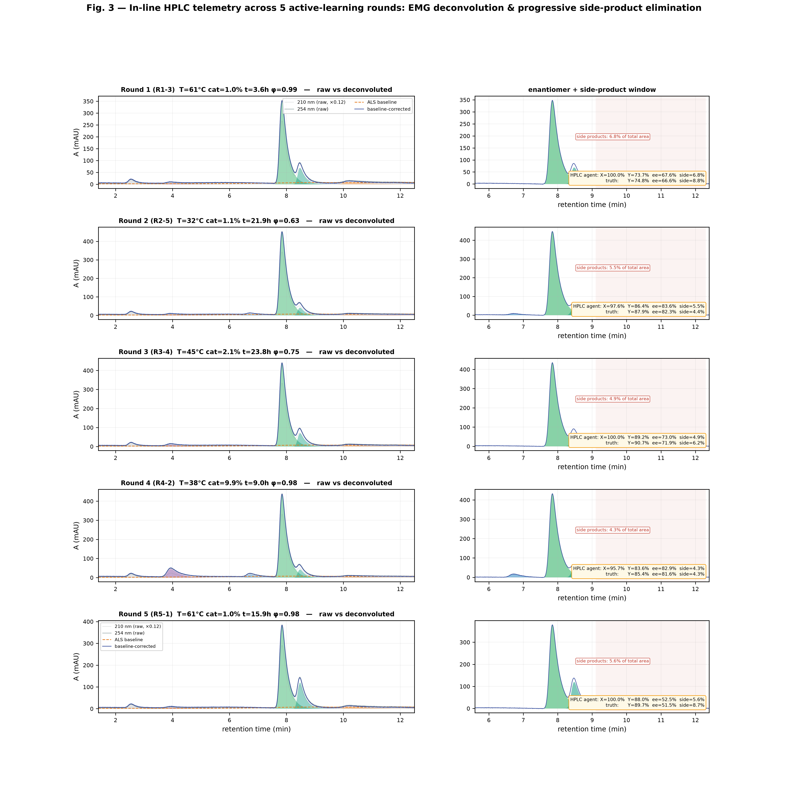

## Reproduce

```bash
pip install rdkit pandas numpy scikit-learn matplotlib seaborn torch torch_geometric

python molecule_benchmark.py --workers 4 --conformers 50   # Phase 1 -> bench_results/
python generate_assets.py                                  # Phase 1 figures -> ./figures/

# Phase 6 (run inside the `phase2ff` conda env: openmm 8.6 + openff-toolkit + xtb on PATH)
C:/Users/HUIWEI/miniconda3/envs/phase2ff/python.exe run_phase6_explicit_metadynamics.py   # -> results_phase6/ + figures_phase6/
C:/Users/HUIWEI/miniconda3/envs/phase2ff/python.exe run_phase6_explicit_metadynamics.py --selftest

# Phase 2 (MD parameterization uses a conda env with openff-toolkit; see DYNAMICS_REPORT_EN.md §6)
python run_heavy_dynamics_benchmark.py                     # full suite -> results_phase2/ + figures_phase2/
python run_heavy_dynamics_benchmark.py --fig_only          # regenerate figures from saved results

# Phase 3 (phase2ff env with Library/bin on PATH; see report §8)
python run_phase3_complex_dynamics.py                      # complex suite -> results_phase3/ + figures_phase3/
python run_phase3_complex_dynamics.py --fig_only           # regenerate figures from saved results

# Phase 4 (needs xtb.exe via conda -c conda-forge xtb, or falls back to ANI-2x)
python run_phase4_reaction_mechanism.py --engine ani       # CI-NEB skeletal editing -> results_phase4/ + figures_phase4/
python run_phase4_reaction_mechanism.py --fig_only         # regenerate figures

# Phase 7 (phase7 env: psi4 1.11 + numpy + scipy + matplotlib + scikit-image;
#          auto-discovers the phase2ff env for xTB/MACE/ANI single points)
conda activate phase7
python run_phase7_strong_correlation_wall.py               # -> results_phase7/ + figures_phase7/
python run_phase7_strong_correlation_wall.py --smoke       # 3-point validation
python run_phase7_strong_correlation_wall.py --fig_only    # regenerate figures from saved results

# Phase 9 (pure numpy/scipy/sklearn/matplotlib; no RDKit/xtb needed)
python run_phase9_self_driving_lab_compiler.py             # full 8-round campaign -> results_phase9/ + figures_phase9/
python run_phase9_self_driving_lab_compiler.py --selftest  # 3-round smoke test
python run_phase9_self_driving_lab_compiler.py --fig_only  # regenerate figures from saved results

# Phase 9 real-hardware syntax gate (isolated venv; opentrons 9.x drops OT-2 — pin 8.3.0)
C:/Users/HUIWEI/miniconda3/envs/phase2ff/python.exe -m venv .ot2env
.ot2env/Scripts/python.exe -m pip install "opentrons==8.3.0"
.ot2env/Scripts/opentrons_simulate.exe output_ot2_protocol.py   # -> rc 0
```

## Repository Structure

```
.
├── molecule_benchmark.py           # Phase 1: per-molecule pipeline (parse → scaffold → GNN tensors → 3D ensemble → analysis)
├── generate_assets.py              # Phase 1: publication figures from benchmark_results.json
├── run_heavy_dynamics_benchmark.py # Phase 2: descriptors → torsion scans → OpenMM MD → figures
├── export_openff_system.py         # Phase 2: OpenFF Sage → OpenMM system.xml (MMFF94 charge surgery)
├── setup_and_download.py           # one-shot environment/dataset bootstrap + self-check
├── BENCHMARK_REPORT_EN.md          # Phase 1 English technical report
├── BENCHMARK_REPORT_ZH.md          # 第一阶段中文技术报告
├── DYNAMICS_REPORT_EN.md           # Phase 2 English dynamics report
├── DYNAMICS_REPORT_ZH.md           # 第二阶段动力学报告
├── figures/                        # Phase 1 fig1–fig3 (300 DPI PNG)
├── figures_phase2/                 # Phase 2 fig1–fig3 (300 DPI PNG)
├── bench_results/                  # Phase 1 outputs
│   ├── benchmark_results.json      # machine-readable records
│   ├── benchmark_report.md         # auto-generated run report
│   ├── sdf/                        # *_ensemble.sdf, *_min.sdf
│   └── features/                   # *.npz (PyG-loadable)
├── results_phase2/                 # Phase 2 outputs (scans, system.xml, DCD, metrics)
├── run_phase3_complex_dynamics.py  # Phase 3: KRAS complex dynamics + MM-GBSA + ML-benchmark
├── COMPLEX_DYNAMICS_REPORT_EN.md   # Phase 3 English report
├── COMPLEX_DYNAMICS_REPORT_ZH.md   # 第三阶段中文报告
├── figures_phase3/                 # Phase 3 fig1-fig3 (300 DPI PNG)
├── results_phase3/                 # Phase 3 outputs (docking, DCD, MM-GBSA)
├── tools/vina.exe                  # AutoDock Vina 1.2.5 CLI (no win/py312 wheel)
├── run_phase4_reaction_mechanism.py# Phase 4: CI-NEB skeletal editing + TS verification
├── SKELETAL_EDITING_REPORT_EN.md   # Phase 4 English report
├── SKELETAL_EDITING_REPORT_ZH.md   # 第四阶段中文报告
├── figures_phase4/                 # Phase 4 fig1-fig3 (300 DPI PNG)
├── results_phase4/                 # Phase 4 outputs (NEB band, TS, frequencies)
├── run_phase5_chemical_world_model.py # Phase 5: reaction network + stiff microkinetics + inverse design
├── WORLD_MODEL_REPORT_EN.md        # Phase 5 English report
├── WORLD_MODEL_REPORT_ZH.md        # 第五阶段中文报告
├── figures_phase5/                 # Phase 5 fig1-fig3 (300 DPI PNG)
├── results_phase5/                 # Phase 5 outputs (network, microkinetics, design)
├── run_phase6_explicit_metadynamics.py # Phase 6: explicit-solvent WTMetaD + 2D FES
├── METADYNAMICS_REPORT_EN.md       # Phase 6 English report
├── METADYNAMICS_REPORT_ZH.md       # 第六阶段中文报告
├── figures_phase6/                 # Phase 6 fig1-fig3 (300 DPI PNG)
├── results_phase6/                 # Phase 6 outputs (FES grids, hills, checkpoints)
├── run_phase7_strong_correlation_wall.py # Phase 7: CASSCF vs mean-field vs AI potentials (wall of sighs)
├── FRONTIER_EPISTEMIC_REPORT_EN.md # Phase 7 English epistemic treatise
├── FRONTIER_EPISTEMIC_REPORT_ZH.md # 第七阶段中文认识论报告
├── figures_phase7/                 # Phase 7 fig1-fig3 (300 DPI PNG)
└── results_phase7/                 # Phase 7 outputs (master JSON, scan summary CSV, scan geometries)
├── run_phase9_self_driving_lab_compiler.py # Phase 9: OT-2 protocol compiler + safety-constrained BO + HPLC twin
├── output_ot2_protocol.py          # Phase 9 compiled robot protocol (round-1 batch, opentrons_simulate-verified)
├── SELF_DRIVING_LAB_REPORT_EN.md   # Phase 9 English treatise
├── SELF_DRIVING_LAB_REPORT_ZH.md   # 第九阶段中文报告
├── figures_phase9/                 # Phase 9 fig1-fig3 (300 DPI PNG)
└── results_phase9/                 # Phase 9 outputs (master JSON, champion protocol, JSON-LD, validation report)
```

> This repository also preserves the earlier sibling project [`aqueous-solubility-ml-benchmark`](https://github.com/songsiyi2006-chem/aqueous-solubility-ml-benchmark) (ESOL/AqSolDB solubility modeling) in its history — see the initial commit.

## License

MIT — see [`LICENSE`](./LICENSE).
