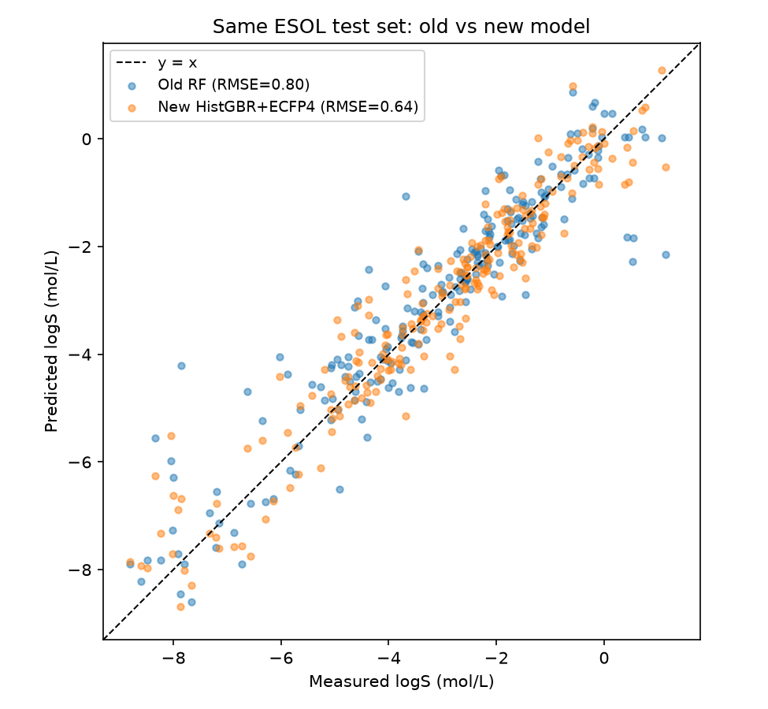
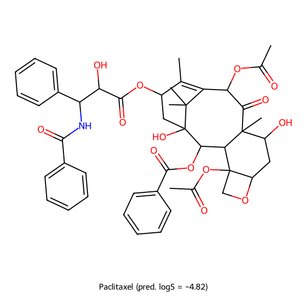

# aqueous-solubility-ml-benchmark

[](LICENSE)
[](https://www.python.org/)
[](https://www.rdkit.org/)

A reproducible, step-by-step benchmark of **aqueous solubility (log S) prediction**
for small molecules — evolving from a minimal 4-descriptor QSAR baseline to an
industrial-grade model trained on the full **AqSolDB** reference database with
**ECFP4 topological fingerprints** and gradient boosting.

The project culminates in a case study on **Paclitaxel (Taxol®)**, one of the
most notoriously water-insoluble anticancer natural products, where the final
model lands **inside the literature-reported solubility range** while the
baseline overestimates it by ~30×.

---

## Project Overview

This repository documents a deliberate *model-complexity progression*, where
each stage exposes a specific limitation of naive QSAR modeling:

| Stage | Script | Data | Features | Model |
|-------|--------|------|----------|-------|
| 0. Warm-up | `molecules.py` | 2 molecules | MW, formula (RDKit basics) | — |
| 1. Toy classifier | `predict_solubility.py` | 6 hand-labeled molecules | MolLogP, TPSA | `DecisionTreeClassifier` |
| 2. Baseline regression | `esol_model.py` | Delaney **ESOL** (1,128 mols) | MolWt, MolLogP, NumRotatableBonds, TPSA | `RandomForestRegressor` |
| 3. **This benchmark** | `aqsol_model.py` | **AqSolDB** (9,980 mols) | 11 physchem descriptors **+ 2048-bit ECFP4** | `HistGradientBoostingRegressor` |

**Key lessons encoded in the progression:**

- A one-feature decision tree (TPSA ≤ 8.53 → insoluble) "solves" the toy problem
  but says nothing about real chemistry.
- The ESOL baseline reaches R² ≈ 0.85 but is a *2D descriptor count* model: it
  cannot see *how* polar groups are buried in a rigid 3D scaffold.
- AqSolDB (9 curated public datasets, ~10 K diverse drug-like molecules) moves
  complex natural products from "out-of-distribution" to "seen before".
- ECFP4 (Morgan, radius = 2) digitizes every local functional-group environment,
  letting the model learn topology-dependent effects that scalar descriptors
  (TPSA, MolLogP) average away.

## Benchmark Results

### 5-fold cross-validation on AqSolDB

| Metric | Value |
|--------|-------|
| R² | **0.815** |
| RMSE | **1.019 log units** |

For context, the AqSolDB reference paper reports RMSE ≈ 1.2 for its own
built-in models; published state-of-the-art models typically land between
0.95–1.05 log units. Our result is competitive with the current literature
standard, using only 2D descriptors + fingerprints.

### Head-to-head on the same ESOL test set

The two regressors are compared on an **identical held-out ESOL test set**
(n = 226, `random_state=42`). To guarantee a leak-free comparison, the 222
AqSolDB entries duplicating ESOL test molecules are **excluded from training**
— without this guard, AqSolDB's embedded ESOL subset would silently leak the
answers.

| Model | Features | R² | RMSE |
|-------|----------|------|------|
| Baseline: Random Forest (500 trees) | 4 physchem descriptors | 0.864 | 0.803 |
| **This work: HistGradientBoosting** | 11 descriptors + ECFP4 (2059-D) | **0.915** | **0.635** |

**RMSE reduced by 20.9 %** under strictly fair conditions.



The largest gains concentrate in the poorly-soluble region (log S < −5), where
the baseline systematically underestimates insolubility — precisely the region
that matters most in drug formulation.

## Case Study: Paclitaxel (Taxol®)

Paclitaxel — a rigid, cage-like taxane diterpenoid (MW 853.9, TPSA 221 Ų,
MolLogP 3.7, 7 rings, 10 rotatable bonds) — is a canonical stress test for
solubility models. Despite its huge polar surface area, its measured water
solubility is only **~0.3–1 μg/mL** because its esters, hydroxyls and amide are
wrapped inside a rigid scaffold riddled with intramolecular hydrogen bonds.

| Model | Predicted log S | Predicted solubility | Verdict |
|-------|-----------------|----------------------|---------|
| Baseline (ESOL 4-descriptor RF) | −4.82 | 12.8 μg/mL | overestimates ~30× |
| **This work (AqSolDB + ECFP4 + HistGBR)** | **−6.31** | **0.416 μg/mL** | **within literature range** |

**Why the baseline fails:** scalar 2D descriptors see "TPSA = 221 → very
polar → soluble". They are blind to 3D conformational effects — the polar
functional groups exist, but they are topologically *buried*.

**Why this model succeeds:**

1. **In-distribution at last.** AqSolDB contains large, complex drug-like
   molecules; paclitaxel is no longer a far-extrapolation outlier.
2. **ECFP4 sees functional-group topology.** Each atom environment is
   fingerprinted, so the model can learn that *where* a hydroxyl or ester sits
   — solvent-accessible vs. scaffold-buried — controls solubility, something a
   summed descriptor cannot encode.
3. **Practical relevance.** This extreme insolubility is why clinical Taxol®
   requires Cremophor EL solubilization (with its infamous hypersensitivity
   risk) and why albumin-bound nanoparticles (Abraxane®) were developed. An
   early-stage flag of "this molecule will be a formulation nightmare" is
   exactly what computational solubility prediction is for — even before
   exact numbers are reliable.



## Installation & Usage

### Requirements

- Python ≥ 3.10 (tested on 3.14, Windows x64)
- Dependencies: see `requirements.txt`

```bash
git clone https://github.com/songsiyi2006-chem/aqueous-solubility-ml-benchmark.git
cd aqueous-solubility-ml-benchmark
python -m venv .venv
# Windows
.venv\Scripts\activate
# Linux / macOS
# source .venv/bin/activate

pip install -r requirements.txt
```

### Run the full benchmark

```bash
# Stage 0 — RDKit warm-up (caffeine & aspirin properties + structures)
python molecules.py

# Stage 1 — toy decision-tree classifier (6 hand-labeled molecules)
python predict_solubility.py

# Stage 2 — ESOL baseline regression (auto-downloads esol.csv, ~1128 mols)
python esol_model.py

# Stage 3 — full benchmark (auto-downloads AqSolDB, ~10 000 mols, ~4 min CPU)
python aqsol_model.py

# Paclitaxel case study (reuses the Stage-2 pipeline)
python paclitaxel.py
```

All datasets are downloaded automatically on first run and cached locally
(`esol.csv`, `aqsol.csv`). Delete them to force a fresh download.

### Expected outputs

| Script | Output |
|--------|--------|
| `molecules.py` | `figures/molecules.png` |
| `predict_solubility.py` | decision-tree rules, aspirin classification |
| `esol_model.py` | test-set R²/RMSE, `figures/esol_result.png` |
| `aqsol_model.py` | 5-fold CV metrics, head-to-head comparison, `figures/aqsol_result.png`, paclitaxel prediction |
| `paclitaxel.py` | paclitaxel features, log S, μg/mL, `figures/paclitaxel.png` |

## Repository Structure

```
aqueous-solubility-ml-benchmark/
├── README.md
├── LICENSE
├── requirements.txt
├── molecules.py              # Stage 0: RDKit warm-up
├── predict_solubility.py     # Stage 1: toy decision-tree classifier
├── esol_model.py             # Stage 2: ESOL baseline (4 descriptors + RF)
├── aqsol_model.py            # Stage 3: full benchmark (AqSolDB + ECFP4 + HistGBR)
├── paclitaxel.py             # Case study: paclitaxel solubility
└── figures/
    ├── aqsol_result.png      # Old vs new model, same ESOL test set
    ├── esol_result.png       # Baseline measured-vs-predicted scatter
    ├── paclitaxel.png        # Paclitaxel 2D structure
    └── molecules.png         # Caffeine & aspirin structures
```

## Data Sources

| Dataset | Source | License / Citation |
|---------|--------|--------------------|
| **AqSolDB** | [Harvard Dataverse, doi:10.7910/DVN/OVHAW8](https://doi.org/10.7910/DVN/OVHAW8) | Sorkun, M. C.; Khetan, A.; Er, S. *AqSolDB: a curated reference set of aqueous solubility and 2D descriptors for a diverse set of compounds.* **Sci. Data** 6, 143 (2019). [CC BY 4.0] |
| **ESOL (Delaney)** | Delaney, J. S. *ESOL: Estimating aqueous solubility directly from molecular structure.* **J. Chem. Inf. Comput. Sci.** 44, 1000–1005 (2004). Mirrored by [DeepChem](https://github.com/deepchem/deepchem). |

## Limitations

- All models are **2D-only**: stereochemistry, 3D conformers, polymorphism,
  salt/crystal effects and temperature are not modeled. log S predictions are
  for the neutral form at ~25 °C.
- ECFP4 fingerprints are hashed (2048 bits); bit collisions are possible.
- The head-to-head comparison uses a single fixed split; confidence intervals
  over repeated splits are left as future work.
- Predictions are **screening-grade flags, not manufacturing specs** — see the
  paclitaxel discussion above for the correct interpretation.

## Contributing

Issues and pull requests are welcome. Natural extensions: attention-based
graph neural networks (e.g., Chemprop / D-MPNN), conformal prediction
intervals, and a repeated-CV leaderboard across all model stages.

## License

MIT — see [LICENSE](LICENSE).
