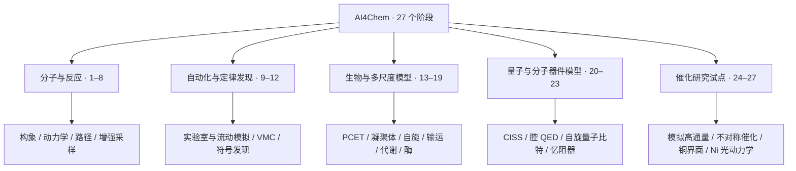
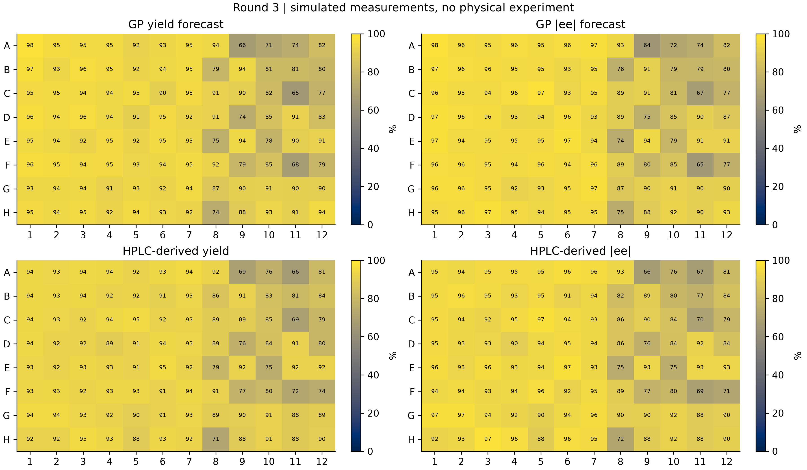

# AI4Chem · Complex Scaffolds Benchmark

**从复杂分子骨架出发的计算化学与 AI for Science 研究原型集合。**

Computational chemistry benchmarks and research prototypes, organized across 27 phases.

[阶段导航 / Phase index](docs/PHASE_INDEX.md) · [证据状态 / Evidence](docs/EVIDENCE.md) · [复现指南 / Reproduce](docs/REPRODUCE.md) · [历史长版 / Archive](README_HISTORY.md)

> **如何理解本项目：** 代码可运行、数值检查通过、科学结论成立、实验验证完成，是四种不同的证据。本仓库包含真实计算、有效模型、合成数据和待验证方案；不能将全部 27 个阶段视为已完成的研究成果。状态来源与局限见[证据说明](docs/EVIDENCE.md)。

## 先看哪里？

| 你的目的 | 推荐入口 |
|---|---|
| 快速理解项目组成 | 下方研究地图 → [27 阶段导航](docs/PHASE_INDEX.md) |
| 查看复杂骨架基准 | [中文报告](BENCHMARK_REPORT_ZH.md) / [English](BENCHMARK_REPORT_EN.md) → [数据](bench_results/) |
| 判断结果是否可靠 | [证据状态](docs/EVIDENCE.md) → [Phase 1–19 收尾清单](PHASE1_19_CLOSEOUT.md) |
| 查看催化方向阶段性工作 | [Phase 25 进展](PHASE25_PROGRESS_ZH.md) → [25–27 验收台账](results_phase25_27/acceptance.json) |
| 运行一个模块 | [复现指南](docs/REPRODUCE.md) → 对应阶段的依赖与命令 |
| 查找原有图表与详细介绍 | [历史长版](README_HISTORY.md)，结合更正与重算记录阅读 |

## 研究地图

以下按主题组织，**不是已验证的端到端流水线，也不是完成度排名**。

| 主题 | 阶段 | 内容与入口 | 阅读时的边界 |
|---|---|---|---|
| 分子与反应 | 1–8 | [构象、MD、反应路径、增强采样](docs/PHASE_INDEX.md#molecules) | 部分重算中断或采样不足；单虚频不等于 IRC 连通性 |
| 自动化与定律发现 | 9–12 | [实验室模拟、流动孪生、VMC、定律发现](docs/PHASE_INDEX.md#automation) | 模拟器检查不等于真实设备验证 |
| 生物与多尺度模型 | 13–19 | [PCET、凝聚体、自旋、输运、代谢、酶设计](docs/PHASE_INDEX.md#biological) | 各阶段有独立近似与验收门槛 |
| 量子与分子器件模型 | 20–23 | [输运、腔 QED、量子比特、储备池](docs/PHASE_INDEX.md#devices) | 有效模型或指定模型参数，不代表器件实测 |
| 催化研究试点 | 24–27 | [高通量模拟及三项催化任务](docs/PHASE_INDEX.md#catalysis) | 24 为合成响应；25–27 科学验收未完成 |

## 证据概览

这里汇总仓库已提交记录，**不是实时计算监控**。旧报告里的“运行中 / 排队”仅描述当时快照。

- **Phase 1–19：** [逐阶段收尾清单](PHASE1_19_CLOSEOUT.md)区分已通过的检查、失败、部分验收和待重算；[公开审计包](audit/phase1_19_rerun_20260910/README.md)提供命令与哈希。
- **Phase 20–23：** 模型计算与检查见对应报告和 `summary.json`；Phase 23 未达到原定 NMSE < 0.01 与 sub-fJ 目标。
- **Phase 24：** [模拟高通量原型](PHASE24_GXNU_AI_HTS_REPORT_ZH.md)，反应响应为合成数据，描述符含代理量；没有已投运的真实实验平台。
- **Phase 25–27：** [验收台账](results_phase25_27/acceptance.json)为 `NOT_SCIENTIFICALLY_COMPLETE`。Phase 25 有 xTB/DFT 阶段性计算，选择性未判定；Phase 26 无完整溶剂化界面采样；Phase 27 无新非绝热轨迹。

## 图示预览：Phase 24 模拟高通量

下面展示的是**模拟孔板预测与合成响应**，用于理解软件流程，不是实验产率或 ee。

[查看报告](PHASE24_GXNU_AI_HTS_REPORT_ZH.md) · [数据与指标](results_phase24/metrics.json) · [其他阶段图表](docs/PHASE_INDEX.md)

## 目录怎么读？

| 路径 | 用途 |
|---|---|
| `docs/` | 阶段导航、证据解释、复现入口 |
| 根目录 `*.py`、`phase25_27/` | 阶段程序、审计与复现工具 |
| 根目录 `*_REPORT_EN.md / *_REPORT_ZH.md` | 英文 / 中文技术报告 |
| `bench_results/`、`results_phase*/` | 已保存的计算、模拟与验证输出 |
| `figures/`、`figures_phase*/`、`figures_hts_pilot/` | 图表；应结合对应运行与审计记录解读 |
| `audit/`、`PHASE*_NOTES.md`、`PHASE*_FIXES.md` | 来源、修复、更正及重算证据 |
| `README_HISTORY.md` | 原首页的历史叙述与图表，保留供追溯 |

为保持脚本路径与已有证据哈希可用，本次采用导航层整理；计算代码与结果路径保持兼容。

## Reproduction & license

Start with the [reproduction guide](docs/REPRODUCE.md). Dependencies differ by phase; the root requirements file is not a complete environment for all 27 phases. This documentation update does not rerun scientific calculations.

Repository code license: [MIT](LICENSE). Third-party data and recovered coordinates retain their original attribution and license conditions; see [Phase 25–27 source guidance](phase25_27/README.md).
