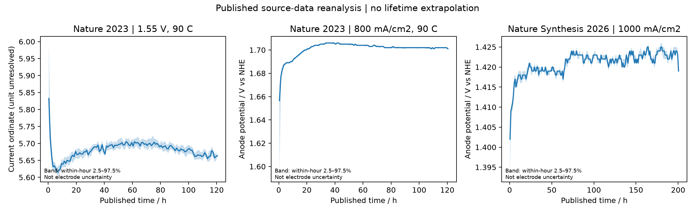

# Phase 28 · 有机氯碱电极：公开数据、失活识别与同产出核算

[全部阶段](../README.md) · [原始任务](TASK_PROMPT.md) · [中文报告](reports/TECHNICAL_REPORT_ZH.md) · [English report](reports/TECHNICAL_REPORT_EN.md) · [验收状态](results/acceptance.json)

**已执行公开数据再分析与本地计算；没有新增实验、界面 DFT 或工业验证。** 本次以 Nature 2023 / Nature Synthesis 2026 两篇合作成果为文献基线。保留三个公开稳定性序列的 **196,496 条原始数值行**，审计重复时间戳、单位和功能单位；这些行不能算独立电极样本。



## 追加的公开数据计算

[中文补充报告](reports/ADDITIONAL_PUBLIC_ANALYSIS_ZH.md) · [English addendum](reports/ADDITIONAL_PUBLIC_ANALYSIS_EN.md) · [新增计算结果](results/additional_public_analysis/summary.json)

本次新增 **50条公开产量/FE摘要与777个极化坐标**，完成50个小样本均值区间、48组未知协方差对比、28个共同电流插值和72组启动/窗口稳健性计算，另有3张新图。

- 24 h Cl₂为0.338190 mol；在n=4独立、近似正态重复的假设下，点态95%均值区间为0.326924–0.349456 mol。没有补造4条原始重复。
- **初版+44/+17 mV受到早期时间窗口影响**：在分析者设定的“排除至少10 h”网格内，2023变为−4至+9.25 mV，2026为+3至+6 mV；10 h不是已证实的物理稳态界限。
- 100/200 h极化曲线在不同电流处差值变号；0 h跨图匹配与iR口径仍不确定，不能据此宣称整体活性提升或节电。

独立复现：`python projects/phase28/code/additional_public_analysis.py --out work/runs/phase28_public_extra_new`。合计 **18项测试通过**。原始运行目录与原始技术报告保留为初版记录，当前新结果详见补充报告与验收JSON。

## 初版结果（历史记录）

- 实际公开数据：2023 恒电流曲线首/末一小时中位阳极电位相差 **+44 mV**；2026 为 **+17 mV**。这是指定窗口描述量，不是新寿命测量或跨论文优劣排名。
- 识别性：在写明的守恒模型中，电压只能识别两种损失速率的和；联合有机层/溶出观测在既定假设下使局部秩由 **1 升至 2**。
- 动态负荷：同 48 h、同电荷、同假定合格产出下，既定简单规则成本约下降 **0.84%**，MPC 约增加 **0.36%**。这些是合成场景；没有达到预设 5% 改进门槛。
- 不确定性：每策略 2,000 次情景抽样，失效前提不满足的抽样被保留为不可行；可行情景仍无一次达到 5%。不称为参数后验或真实收益置信区间。
- 初版11项守恒、单位、删失、批次隔离、因果性和约束检查通过；追加7项公开数据计算检查后合计18项。

## 定位文件

| 内容 | 入口 |
|---|---|
| 公开来源、全文/SI访问范围 | [来源清单](data/literature/source_manifest.json)、[文献主张](data/literature_claims.csv)、[数据说明](data/literature/README.md) |
| 原始数值与时间轴审计 | [提取清单](data/literature/extraction_manifest.json)、[描述统计](results/run_20260920/published_trace_metrics.csv) |
| 机制/创新边界 | [机制辨别](reports/mechanism_discrimination.md)、[新颖性对照](reports/novelty_matrix.md) |
| 模型、控制、核算代码 | [code/](code/)、[冻结配置](configs/local.json) |
| 同产出比较和敏感性 | [比较表](results/run_20260920/fair_comparison.csv)、[全部结果](results/run_20260920/) |
| 产业需求与资源 | [产业需求](reports/industry_requirements.md)、[资源预算](reports/resource_plan.md) |
| 来源与结果 SHA256 | [来源哈希](data/literature/source_manifest.json)、[交付哈希](results/artifact_manifest.json) |

## 复现

已有 Python + numpy/scipy/matplotlib 即可，无默认联网或自动安装。从仓库根目录运行：

```sh
python projects/phase28/run.py --self-test
python projects/phase28/run.py --out work/runs/phase28_new
```

必须使用新输出目录。Windows 的 chem-ai4s 依赖路径见[资源说明](reports/resource_plan.md)。源 XLSX 重新提取才需要 openpyxl。固定基准中的 FE、面积、清除速率等参数若被改成当前实现不支持的值，程序会拒绝运行，避免静默忽略配置。调度场景要求可用供电至少维持额定负荷；不覆盖供电低于基本生产需求的装置。

既有 Phase 1–27 保持原状态；未把 Phase 24 合成响应或 Phase 26 未校准界面当作真实电极训练数据。后续科学提升需要独立位点/溶出/产品观测，而非扩大合成样本数。
