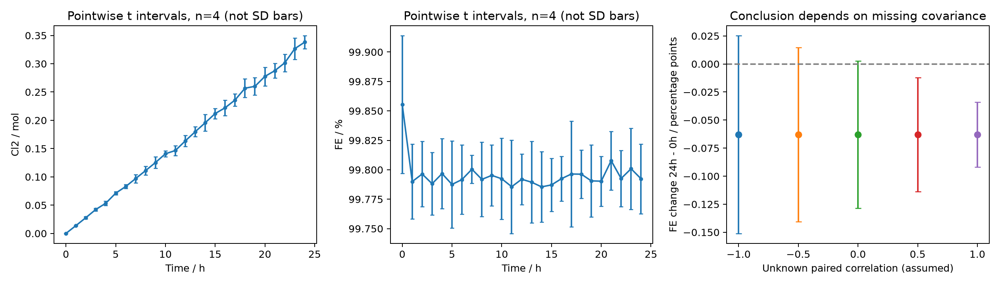
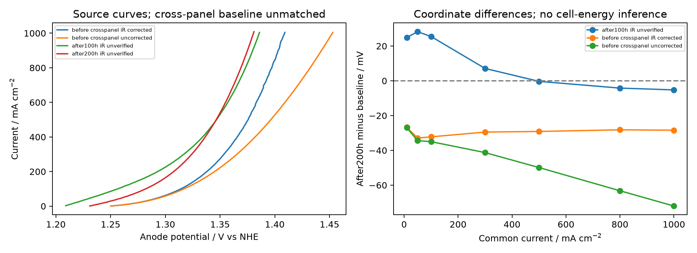
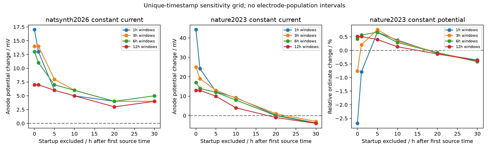

# Phase 28 补充计算：重复实验摘要、极化曲线与启动敏感性

本次应用户“补充更多计算”要求，新增的是**真实公开数值的分析**，没有增加合成样本来代替新证据。初版 `results/run_20260920/` 完整保留。本次独立配置、输入和输出分别位于 `configs/additional_public_analysis.json`、`data/additional_public/`、`results/additional_public_analysis/`。

## 1. 新增输入与实算量

以 [Nature Synthesis 2026 Figure 2](https://www.nature.com/articles/s44160-026-01039-y/figures/2) 公开 XLSX 为来源，提取 Figure2e/f 的50条时间点汇总记录，以及2a/2h的777个极化坐标。保存原工作表、Excel行号、列号和文件SHA256。图注及SI打印p1/PDFp4说明相关误差条是**4次独立实验的均值±标准差**，不是标准误。

源文件没有4条重复的逐一数值或跨时间的配对ID，因此不能重建原始重复、真实相关系数或直接进行已知配对检验。共执行50个均值区间、48组时间差值/相关性敏感性计算、28个共同电流插值与72组启动/窗口网格。原3条稳定性序列继续单独处理，不当成独立电极重复。

## 2. 产量、FE与小样本不确定性

每时点均值的点态95%区间采用 `mean ± t(0.975,3) × SD/√4`，临界值3.18245。此计算要求同一时点的4个重复独立且近似正态；原始数据缺失使分布假设无法核验。**这些区间不是所有时间点同时覆盖的置信带**，也不把25个累计时间点当成25次独立实验。

| 量 | 公开均值 / 本次计算 | 条件性95%均值区间 |
|---|---:|---:|
| 24 h累计Cl₂ | 0.338190 mol | 0.326924–0.349456 mol |
| 24 h平均Cl₂速率 | 0.01409125 mol/h | 0.01362184–0.01456066 mol/h |
| 24 h FE | 99.79236% | 99.76278–99.82194% |

过原点最小二乘累计产量斜率为0.01391599 mol/h，最大残差0.00651228 mol，仅为曲线形状描述；没有利用未知时间协方差计算斜率显著性。零时累计产量0是固定原点，不当成观测到零方差的随机群体。

FE的24 h−0 h均值差为 **−0.06296个百分点**。若误把两个时点直接视作独立组，Welch区间为[−0.11799, −0.00793]个百分点；若是同4次实验的配对记录，差值标准误应依赖未知相关系数ρ：

```text
SE(diff) = sqrt((SD0² + SD24² − 2ρ SD0 SD24)/4)
```

配对ρ=0时，t(df=3)区间为[−0.12852,+0.00260]，已经跨零；ρ=−1时为[−0.15105,+0.02513]；ρ=0.5时为[−0.11363,−0.01229]。因此是否排除零**受缺失配对信息影响**，不能挑一个假设宣布确定退化。24 h−1 h只有+0.00240个百分点，也不能据不显著直接声称等效稳定；本次没有预先设定并检验等效界值。



## 3. 100/200 h极化曲线：变化不是单一平移

对原始电流严格单调的正电流区间，在线性插值与PCHIP之间交叉检查，在10、50、100、300、500、800、1000 mA/cm²共同网格计算电位。禁止外推。两种插值方法最大差仅0.04372 mV，属于数值插值敏感性，不代表实验测量精度。

| 电流密度 | 200 h−100 h阳极曲线坐标差 |
|---:|---:|
| 100 mA/cm² | +25.480 mV |
| 500 mA/cm² | −0.311 mV |
| 1000 mA/cm² | −5.209 mV |

两条曲线发生交叉，不能用高电流点的小负差宣称整体活性改善。二者来自同一2h源表，但iR处理未得到充分说明，仍仅称阳极坐标差。未积分成槽电耗。

原2h源表和图例没有独立“0 h”数值序列；只能把2a中的初始1a曲线作为**跨图代理基线**。其与耐久测试是否同一电极/同一iR处理未确定。在1000 mA/cm²，200 h相对于2a校正/未校正曲线分别为−28.408/−71.995 mV。这一巨大口径差说明0/100/200 h三者不能直接包装为已匹配寿命进展；代码保存两种敏感性口径，没有选择有利的一种。



## 4. 原始“首末变化”有多少来自启动段

先按每个独特时间戳取纵轴中位数，防止重复导出行改变权重。固定网格为启动排除0/1/5/10/20/30 h × 首末窗口1/3/6/12 h，3条序列共72组合。启动排除按“源文件第一个时间+排除量”定义；结尾窗口不移动。

| 序列 | 全网格首末变化范围 | 排除至少10 h后的范围 |
|---|---|---|
| Nature2023恒电流电位 | −4.00至+44.25 mV | −4.00至+9.25 mV |
| Nature Synthesis2026恒电流电位 | +3.00至+17.00 mV | +3.00至+6.00 mV |
| Nature2023恒电位电流纵轴 | −2.686%至+0.762% | 原始纵轴差−0.02375至+0.02125，跨零 |

初版+44/+17 mV仍正确描述其指定首末小时，但新计算显示它们**对早期时间窗口明显敏感**，不宜解释为均匀失活速率。10 h是分析者设定网格中的描述分界，不是已证实的物理稳态边界；仅凭时间变化不能确定初期漂移的物理原因。2023恒电位电流单位的原有疑点保持未解决，因此只给尺度不变相对量或未经换算的纵轴差。网格是描述性敏感性，不产生电极总体置信区间，也不据选择性排除启动宣布“没有退化”。



## 5. 复现与边界

```sh
python projects/phase28/run.py --self-test
python projects/phase28/code/additional_public_analysis.py --out work/runs/phase28_public_extra_new
```

新增7项检验与原11项合计18项通过；包括小样本t临界值、Welch自由度、协方差范围、禁止外推、拒绝乱序极化曲线、时间戳去重和窗口重叠拒绝。3张新图已实际打开检查。来源与输入输出哈希见 [manifest](../results/additional_public_analysis/input_output_manifest.json)。

本次进一步确定的是**统计口径和启动敏感性限制**。没有新增实验、没有校准真实失活机理、没有真实全寿命工业收益结论。初版数值输出和历史验收记录保持可追溯，当前验收在 `results/acceptance.json`。
