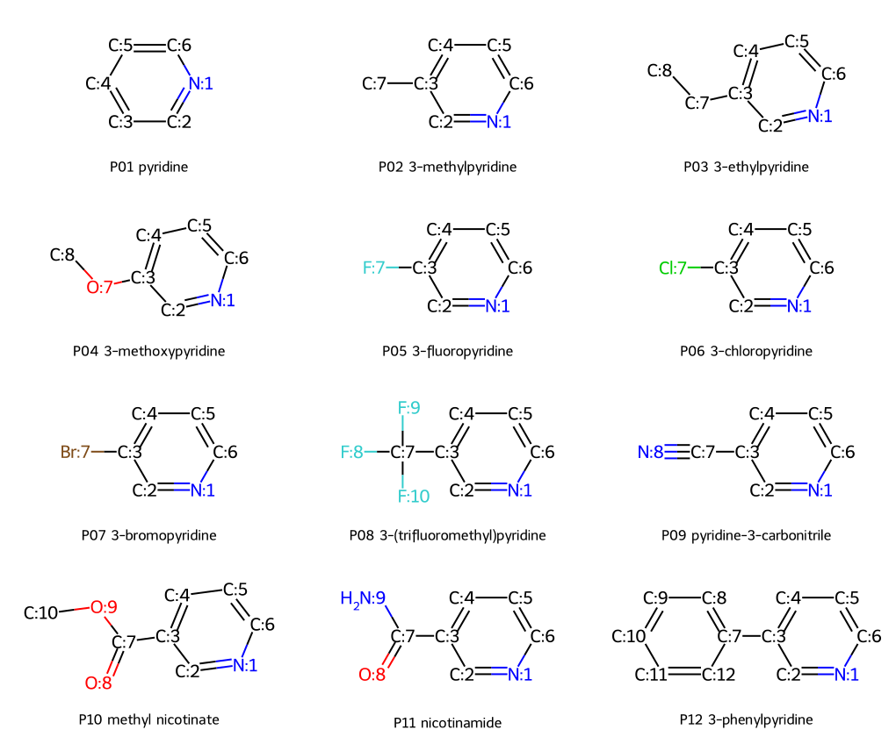

# Phase 29 · 医药吡啶位点控制：公开证据审计与本机计算

**当前结论：完成可复现的公开数据审计、结构/构象计算、分子方法敏感性诊断和算法原型；未证明同底物 C2/C4 切换、机制或制造优势。没有新增实验数据。**

第二轮新增：[144 次 xTB 方法/环境矩阵](reports/xtb_matrix_zh.md)与[气相 DFT 交叉检查](reports/dft_crosscheck_zh.md)。两者使用明确匹配的几何、电荷与自旋状态；DFT 是另一种近似模型，不是实验真值。首轮数据与输出仍保留，新增原始输出分别在 `results/xtb_matrix/` 和 `results/dft_crosscheck/`。

最重要的发现是，JACS 模型为 **4-苯基吡啶 + 苯甲醛**，C4 已被占据；Nature Communications 模型为 **2-苯基吡啶 + 对甲氧基苯乙酮**，原底物 C2 已被占据。两者所得分别为仲醇和叔醇，不能直接拼成“同底物位点切换”的证据。两篇 SI 的命名、负载量和产物脚注疑点均保留在审核表内。

| 内容 | 本次真实完成 | 入口 |
|---|---|---|
| 原文/SI 与最近邻 | 40 条公开条件记录、14 条公开 DFT 能量、2 个原子映射重建参考反应 | [数据卡](reports/data_card.md)、[查新](reports/novelty_matrix.md) |
| 结构计算 | 12 个拟议底物、36 个重原子映射方案；48 个结构记录、151 个构象尝试，其中 150 收敛；每种记录保留一个收敛构象 | [冻结计算面板](configs/preregistered_panel.json)、[结构审核 CSV](data/reaction_identity_audit.csv) |
| 公开数值复核 | 重算文献 9.72/12.03 kcal/mol 势垒及电荷、FE、溶液体积口径通量 | [文献数值审计](results/public_DFT_table_audit.json)、[电气指标](data/literature/derived_electrical_metrics.csv) |
| 实际分子量子诊断 | 3 种质子化吡啶、GFN1/GFN2、12 次固定几何单点；方法差异及数值警告完整保留 | [量子预检](results/quantum_preflight/README.md) |
| 方法软件 | 5 个假设动力学情景、120 次参数传播；120 个合成家族的基线/校准/成本预算流程 | [机制辨别](reports/mechanism_discrimination.md)、[合成学习结果](results/synthetic_learning.json) |
| 产业衔接 | CRO 与 CDMO 需求、分离损失、电量和技术转移缺口 | [产业需求](reports/industry_requirements.md) |
| 验收 | 软件与局部计算通过，G2–G5 未满足 | [acceptance.json](results/acceptance.json) |

[中文技术报告](reports/technical_report_zh.md) · [English report](reports/technical_report_en.md) · [原始任务](TASK_PROMPT.md) · [计算资源与续接](reports/resources_and_handoff.md)



从仓库根目录运行（已有 RDKit / NumPy / SciPy / scikit-learn / matplotlib；不自动安装）：

```powershell
$env:PATH = 'C:\Users\HUIWEI\miniconda3\envs\phase2ff\Library\bin;' + $env:PATH
$env:OMP_NUM_THREADS = '2'
$env:MKL_NUM_THREADS = '2'
$env:OPENBLAS_NUM_THREADS = '2'
& 'C:\Users\HUIWEI\.codex\tools\chem-ai4s\venv\Scripts\python.exe' projects/phase29/run.py --self-test
& 'C:\Users\HUIWEI\.codex\tools\chem-ai4s\venv\Scripts\python.exe' projects/phase29/run.py --out work/runs/phase29-example
```

`--out` 必须指向尚不存在的独立目录；不传参不会覆盖证据。仅作者用 `--refresh-committed` 明确更新归档。主程序不会重跑可选 xTB；其命令、输入、输出和说明独立保存。所有 `data/synthetic/` 曲线只验证方法流程，不是化学预测或节省真实实验的证据。预算循环使用多样性/距离与预测位点分数的代理规则；完整产率/杂质/成本效用函数仅实现并测试，尚未以真实或合成多目标数据评估。C2/C6 在未取代吡啶上对称等价，36 条映射不是 36 个独立产品或成功反应。

可选完整 xTB 预检复跑（使用已经安装的执行文件，输出到新目录）：

```powershell
& 'C:\Users\HUIWEI\.codex\tools\chem-ai4s\venv\Scripts\python.exe' projects/phase29/code/xtb_diagnostics.py --xtb 'C:\Users\HUIWEI\miniconda3\envs\phase2ff\Library\bin\xtb.exe' --out work/runs/phase29-xtb-example
```

依赖版本见 [requirements.txt](requirements.txt)；这是本次环境记录，优先复用已安装软件，不要求再次安装。
