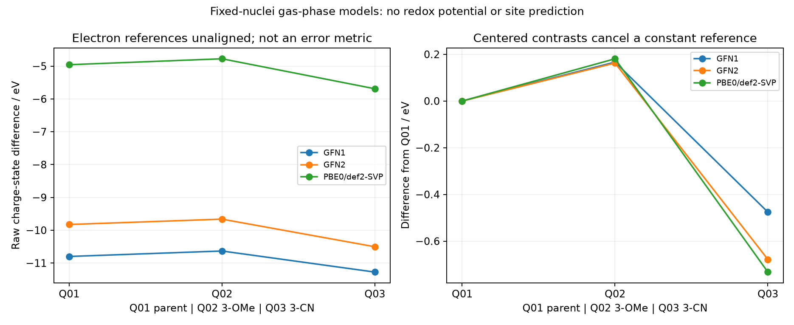

# Phase 29：固定几何气相 PBE0 交叉检查

[项目入口](../README.md) · [English](dft_crosscheck_en.md) · [xTB 矩阵](xtb_matrix_zh.md) · [原始输出](../results/dft_crosscheck/)

2026-09-20，使用已有 Psi4 1.11，实际完成 8 次单点，8 次 SCF 收敛。这里的 DFT 是独立近似模型，不是实验真值。它不包含催化表面或羰基反应伙伴，不能判断 C2/C4 选择性。

## 计算对象和方法

Q01 为假设 N-质子化吡啶，Q02 为 3-甲氧基衍生物，Q03 为 3-氰基衍生物；分别对应 xTB 矩阵 P01/P04/P09。每个分子复制首轮 MMFF 阳离子几何，SHA256 完全匹配，没有重新优化。比较 +1 单重态 RKS 与 0 双重态 UKS，固定相同核坐标，定义 ΔE = E(中性自由基) − E(阳离子)。这是电子数改变的模型能量差。

三个分子均用 PBE0/def2-SVP；仅 Q01 加做 def2-TZVP。采用密度拟合 SCF、75×302 DFT 网格、能量/密度收敛阈值 10⁻⁹/10⁻⁷、最多 150 次迭代；串行作业，每次 2 线程、900 MB、300 s 超时。八次作业合计约 396 s。输入配置见 [dft_crosscheck.json](../configs/dft_crosscheck.json)，时间和输入脚本哈希见 [manifest.json](../results/dft_crosscheck/manifest.json)。方法选项参见 [Psi4 DFT 文档](https://psi4.github.io/psi4docs/master/dft.html)与 [SCF 文档](https://psi4.github.io/psi4docs/master/scf.html)。

## 实际结果

| 分子 | 基组 | ΔE / eV | 自由基 ⟨S²⟩ |
|---|---|---:|---:|
| Q01 | def2-SVP | −4.957325 | 0.776918 |
| Q02 | def2-SVP | −4.776458 | 0.770825 |
| Q03 | def2-SVP | −5.689793 | 0.775537 |
| Q01 | def2-TZVP | −4.997139 | 0.775941 |

双重态理想值为 0.75，当前偏离约 0.021–0.027；RKS 的接近零负值属于浮点舍入。⟨S²⟩由占据轨道与 AO 重叠矩阵计算，公式和电子数存于每个 `result.json`。未检查波函数稳定性，收敛不等于找到唯一正确电子态。Q01 换基组改变 −0.039814 eV；单个分子的两个非弥散基组不足以证明基组收敛。

## 电子参考必须先区分

原始 GFN1/GFN2 与 PBE0/def2-SVP 的 ΔE 分别相差约 −5.86 至 −5.59、−4.89 至 −4.81 eV。这些是**未对齐电子参考的原始偏移，不能作为预测误差**。官方 [tblite 教程](https://tblite.readthedocs.io/en/latest/tutorial/python/singlepoint.html)在 GFN2 示例中说明电离能差需要经验自由电子自相互作用修正；[xTB 单点文档](https://xtb-docs.readthedocs.io/en/latest/sp.html)另区分专门 IPEA 参数化。这里没有运行 `--vipea`，也没有为两个 GFN 方法盲目套用同一经验常数。

可比较的补充量为每种方法内部的中心化双差 ΔE(取代物)−ΔE(Q01)，共同常数参考偏移会抵消。所有模型使用同一分子对应的完全相同几何，并限定气相：

| 取代效应 / eV | PBE0/def2-SVP | GFN1 | GFN2 |
|---|---:|---:|---:|
| Q02 − Q01 | +0.180867 | +0.166602 | +0.162533 |
| Q03 − Q01 | −0.732468 | −0.475732 | −0.678319 |

两种取代效应的方向一致；氰基效应相对 PBE0 的幅度差为 GFN1 +0.256736 eV、GFN2 +0.054149 eV。这里只覆盖两个取代效应，没有证明 GFN2 总体更准，也没有检验实验趋势。中心化消除了常数参考，不能消除所有方法偏差。



## 复现和边界

在项目 README 的已有 Python 与 DLL 环境下，从仓库根目录运行；输出目录必须尚不存在：

```powershell
python projects/phase29/code/dft_crosscheck.py --python C:/Users/HUIWEI/miniconda3/envs/phase7/python.exe --out work/runs/phase29-dft-new
python projects/phase29/code/compare_quantum_models.py --dft work/runs/phase29-dft-new --xtb-csv projects/phase29/results/xtb_matrix/state_differences.csv --out work/runs/phase29-dft-comparison-new
```

首个 `python` 为已有化学工作环境，`--python` 指向已有 Psi4 环境；脚本不安装软件。只重算已保存能量的派生表可用 `dft_crosscheck.py --analyze NEW_COPY_OF_RESULT_DIR`，不要覆盖冻结结果。原生 Psi4 输出中的部分系统计时字段为 nan；外部墙钟时间另行保存，能量均为有限数值。

标准 GFN1/GFN2 的开壳层处理与这里的 UKS 不等价；`--uhf 1` 指定未配对占据，不会自动启用独立的 `--spinpol --tblite` 模型，本轮也未使用后者。参见 [xTB 自旋极化文档](https://xtb-docs.readthedocs.io/en/latest/spgfn.html)。匹配电子数与几何不代表匹配自旋近似。

尚缺几何/构象收敛、弥散基组、波函数稳定性、溶剂与反离子、界面恒电位、自由能与过渡态/IRC。因此没有实验电位、位点切换、催化机理或制造优势的新证据。与 [验收状态](../results/acceptance.json)一致，后续实验门槛不因 SCF 收敛而升级。
