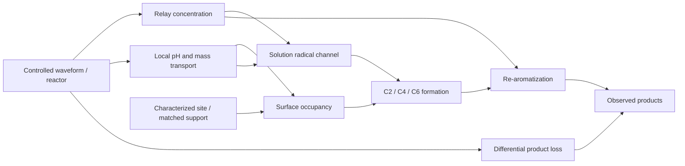

# 三个可证伪假设与最小机制研究

这里的机制是待检验解释。文献结果、参数假设和实际计算彼此分开。

| 假设 | 候选机制 | 支持需要什么 | 反证/竞争解释 | 最小区分设计 |
|---|---|---|---|---|
| H1 可测界面占据改变初始分支 | 表面配位导向 vs 质子化溶液自由基 | 匹配局部环境后，位点表征与初始 C2/C4/C6 生成速率一致变化 | 位点去除但匹配载体仍同样改变；酸度/传质足以解释 | 表征匹配位点/载体 × 中继有/无；定时取样并测局部环境 |
| H2 中继对后续再芳构化有独立作用 | 阳极中继生成、捕获、后续氧化 | 中继及阳极物种流量改变在恒定阴极状态下仍能影响中间体寿命和产物形成 | 阴极电位、局部酸度、跨膜传质同时变化，无法独立归因 | 隔离阳极、受控加入预生成中继/阳极流出物，与完整电解池对照 |
| H3 表观位点富集可来自后续损失 | 差异产物消耗 vs 形成分支 | 独立异构体加入/回收及时间序列能预测最终富集 | 回收一致且初始生成速率已不同 | 已鉴定 C2/C4/C6 标准品分别加入；匹配电量的静态/脉冲对照 |

传质与局部环境是 H1/H2 的共同混杂因素。匹配 BET 面积、几何面积、载量和电阻并不保证相同有效电化学面积；对电容电流与法拉第电流分别建账。毒化、热过滤、TEMPO 捕获或一项谱图均不单独定机理。

## 已执行的动力学诊断

`code/phase29.py` 用小时为时间单位，`S,P2,P4,P6,D` 为底物当量；`R,theta` 分别是假设的中继活性分数和占据分数。

```text
flux = activity * waveform
v2 = flux * S * (k2_solution * R + k2_surface * theta)
v4 = flux * S * (k4_solution * R + k4_surface * theta)
v6 = flux * S * k6 * R
dPi/dt = vi - loss_i * R * Pi
dD/dt = side * flux * S + sum(loss_i * R * Pi)
dR/dt = (setpoint * waveform - R) / tau_R
dtheta/dt = (surface * R/(1+R) - theta) / tau_theta
```

全部速率为预设 `h^-1` 假设，没有用文献产率拟合。模型守恒的是吡啶当量，不是完整原子、电荷或碘物料衡算；未显式计入伙伴耗尽、溶液 pH、EDL、电流电位关系和不同法拉第效率，不能预测真实波形效果。两种波形只匹配模型驱动的积分电量，不声称匹配实际有效法拉第电量。

终点两个产物观测无法辨识六个速率参数；增加时间点后仍可能存在表面/溶液通道线性组合的结构性退化。使用中央差分和相对阈值 `1e-4` 的灵敏度矩阵计算其秩，再加入匹配载体干预。见 [原始数值](../results/synthetic_kinetics.json)。这是实验设计可辨识性的模型诊断，不是实际机制证实。

最有用的反例：假设 C4 产物后续快速损失时，模型的 `s2≈0.919`，但三种异构体总产率只有 `≈0.179`，且 C6 占比明显升高。只报 s2 会制造“高选择性”的错误印象。预注册 40% 的 C2+C4 总产率下限及全产物物料收支会拒绝它。

120 次独立对数正态速率扰动（log SD=0.65）得到的 s2 区间是**假设敏感性区间，不是实验可信区间或贝叶斯后验**。没有把单一 `exp(-ΔΔG‡/RT)` 当成最终产物比例。

## 最小后续矩阵与停止规则

从 P02/P04/P10 三种环境各选择一个已证明可分析的反应对。第一轮 3 底物 × 4 个位点/中继因子组合 × 3 独立重复 = 36 次反应；每次 0/1/3/6/9 h 取样。其后才进行 3 底物 × 2 静态/脉冲条件 × 3 重复 = 18 次反应，以及 3 标准品 × 2 电解条件 × 3 重复 = 18 次回收对照。预算共 72 次反应（时点取样不是独立重复），另加定量标曲、空白、独立批次与必要表征。这个预算是待实施设计，采购成本未知。

若共同反应域不成立、任一关键异构体不可定量、表面状态不可比、或材料溶出足以改变溶液催化，则暂停位点切换验收并修正问题。先解决这些输入，不扩增黑箱筛选。计入失败、低于检出限和混合产物；不得改换盲测集合或事后放宽阈值。


