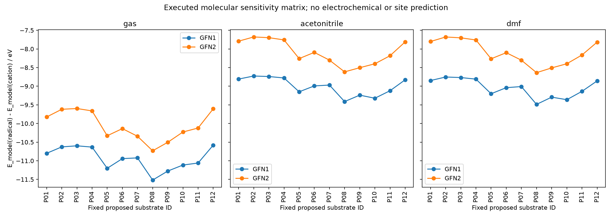

# Phase 29 计算增补：144 次分子方法与环境敏感性单点

2026-09-20。本次新增真实执行 **144 次 xTB 单点**，涵盖既有 12 底物面板 × 2 电荷/自旋态 × 2 方法 × 3 环境。全部 SCC 收敛并正常终止；全部也记录了 IEEE 浮点标志，结果保持为带数值警告的分子诊断。没有新增反应、实验产率或区域选择性预测。

主要结论是：**GFN1/GFN2 未对齐电子参考的原始状态能差相差约 0.58–1.07 eV，部分底物的计算排序也改变。** 原始差额可能包含不同方法的电荷态参考偏移，不能全部当成预测误差；排序变化则表明分子依赖不完全相同。扩展面板仍不足以支持可靠的反应建议。

## 输入与比较定义

[配置](../configs/xtb_matrix.json) 在 12:50:39 UTC 冻结，之后执行计算。只把亲本吡啶环 N 质子化，不质子化酰胺、腈或其他基团。这是待验证的物种假设，不代表实际酸度下的物种分布。

- 阳离子：charge +1、UHF 0；中性自由基：charge 0、UHF 1。每次核电荷/电子数/自旋奇偶性均检查。
- P01/P04/P09 分别逐字复制原 Q01/Q02/Q03 的 XYZ，核对 SHA256、分子式和 canonical cation identity。因此可用于本轮独立 DFT 交叉检查中的同几何气相单点对照。
- 其余 9 个物种使用固定种子 ETKDGv3 + MMFF94 单个阳离子几何。没有构象集合或 xTB 几何优化。两电荷态、两方法和三环境使用相同核几何。
- 方法 GFN1/GFN2；环境 gas、ALPB acetonitrile、ALPB DMF；每次 2 线程，顺序执行；`--acc 0.1`、最多 300 SCC 迭代、每任务 90 s 超时。

定义 `Δ_model = [E_model(neutral radical) − E_model(cation)] × 27.211386245988 eV/Eh`。气相是对应电子结构模型的总能量差；ALPB 输出的总能量还包含模型溶剂项。根据 [xTB 官方文档](https://xtb-docs.readthedocs.io/en/latest/gbsa.html)，采用默认 `gsolv` 参考状态，没有额外 1 bar→1 M 修正。两个电荷态的介质各自平衡，因此不是严格非平衡溶剂的垂直电子亲和能，也不是完整热力学 Gibbs 自由能、还原电位或反应势垒。

**电子参考限制：** [tblite 官方 GFN2 示例](https://tblite.readthedocs.io/en/latest/tutorial/python/singlepoint.html) 对由不同电荷态能量计算的电离势给出每电子 4.846 V 的经验修正，涉及自由电子自相互作用；[xTB 单点文档](https://xtb-docs.readthedocs.io/en/latest/sp.html) 另列专门的 IP/EA 计算途径。本矩阵保留未经该类修正的原始输出，没有应用任何经验位移，也没有把 GFN2 示例中的数值通用地施加于 GFN1 或本研究所有状态。因而跨方法原始差額不能单独量化物理预测准确度。若某方法的电荷态参考偏移是分子/环境无关常数，则同方法的物种排序、相对于 P01 的取代基双差 `Δ(Pi)−Δ(P01)` 及同方法溶剂差会消去该常数；分子依赖仍须与独立证据核对。

## 实际结果

144/144 单点成功形成 **72 个可比状态对**。原 3 分子 × 2 方法的 MeCN 六个状态差与原预检完全重现（保存精度内最大差为 0 eV）；这证明此配置的数值重现，不是独立物理验证。144 次中包含这 12 次单点重跑，不能当成新增独立分子。

| 环境 | 12 物种未对齐参考的 GFN1/GFN2 原始差额绝对值 / eV | 两方法计算排序 Spearman ρ | 66 个物种对中的顺序反转 |
|---|---:|---:|---:|
| gas | 0.57998–1.00864 | 0.91608 | 6 |
| ALPB MeCN | 0.66915–1.04784 | 0.95105 | 4 |
| ALPB DMF | 0.70697–1.07360 | 0.95105 | 4 |

在同一方法下，ALPB 与气相状态差的位移为 **+1.72260 至 +2.11740 eV**。这是这组模型假设下的环境敏感性，不能解释为实际溶剂对电极电位的实验位移。GFN1 和 GFN2 各自从气相换到 MeCN 时，均有 7/66 个物种对顺序改变；MeCN 与 DMF 的排序在各自方法内相同，但数值不同。完整 15 组排序比较保留在 [analysis.json](../results/xtb_matrix/analysis.json)，排序只针对模型状态差，不给产率、活性或 C2/C4 偏好排序。



原始 stdout/stderr、每任务状态/命令/哈希、几何输入和全部失败记录机制均保留。本轮无超时/未收敛任务，但 144/144 均有 `IEEE_DIVIDE_BY_ZERO`，部分另有 `IEEE_DENORMAL` 或 `IEEE_UNDERFLOW_FLAG`。收敛与浮点标志同时存在；未检查编译器级原因，不将警告删除或描述为已经解决。

## 科学解释与下一步

这个扩展结果支持的结论是“必须区分参考偏移与分子/介质依赖，再进行独立校准”，而不是某取代基更适合反应。表中的原始差额既不是实验误差条，也不能全部归因于方法对化学效应的预测失败。模型未包含对离子、酸/盐浓度、显式溶剂、表面位点、电双层、恒电位、反应伙伴、再芳构化及产物消耗；也没有频率/连接性或自由基自旋密度验证。没有根据电荷分布分配反应结果。

与 DFT 的合法对照只能使用相同分子、核几何、气相、电荷和自旋约定；不能拿 gas DFT 去评价 ALPB 数值优劣。小基组 DFT 本身也有近似，不自动成为实验真值。用于本轮独立 DFT 交叉检查的 P01/P04/P09 气相输入和状态差均已独立记录。原阶段 G2–G5 的科学验收状态保持未满足。

## 可恢复文件与验证

[完整状态差 CSV](../results/xtb_matrix/state_differences.csv)、[方法敏感性](../results/xtb_matrix/method_sensitivity.csv)、[环境敏感性](../results/xtb_matrix/environment_sensitivity.csv)、[运行清单](../results/xtb_matrix/manifest.json)、[文件哈希](../results/xtb_matrix/file_manifest.json)。

```powershell
$env:PATH = 'C:\Users\HUIWEI\miniconda3\envs\phase2ff\Library\bin;' + $env:PATH
& 'C:\Users\HUIWEI\.codex\tools\chem-ai4s\venv\Scripts\python.exe' projects/phase29/code/xtb_matrix.py --xtb 'C:\Users\HUIWEI\miniconda3\envs\phase2ff\Library\bin\xtb.exe' --out work/runs/phase29-xtb-matrix-new
```

输出目录必须不存在，原始预检不会被覆盖。新增 8 项测试通过，覆盖冻结矩阵、原几何哈希、警告保留、未收敛拒绝、单位符号、比较条件及顺序反转/并列处理；包含其他计算模块的测试总数以最终集成验证记录为准。图像已实际打开检查，标签与三种环境区分可读。
