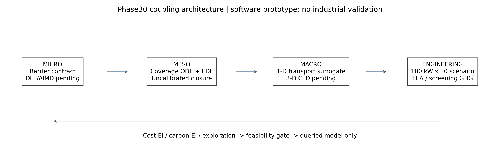
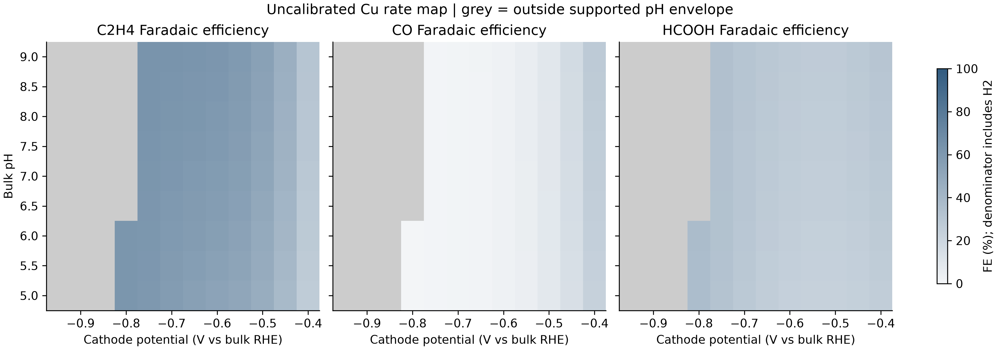
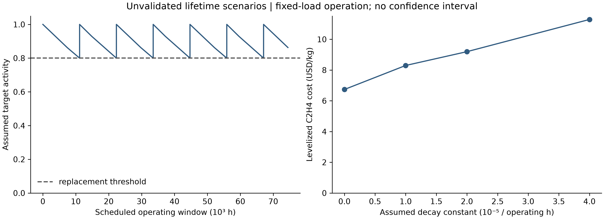

# Phase 30 · 兆瓦级 CO₂ 电催化全尺度数字孪生与自主闭环优化

Megawatt-scale CO₂RR: Multiscale Digital Twin from Operando Interfaces to Industrial Stacks

[阶段导航](../../docs/PHASE_INDEX.md) · [完整技术规格与报告](reports/phase30_technical_report.md) · [接口契约](schemas/CONTRACTS.md)

**当前交付：技术规格、五模块代码骨架和已执行的未校准降阶原型。不是已完成 DFT/AIMD、三维 CFD、operando 实验或兆瓦级装置验证。**

默认单堆100 kW、十堆1 MW为条件情景。可切换 CO/HCOOH/C₂H₄ 为核算目标；
C₂H₄只是 C₂+ 的一个明确代表，不能等同于所有多碳产物。



## 实际实现

| 模块 | 本次可运行内容 | 尚未实现或验证 |
|---|---|---|
| 微观 | 显式假设的 Cu/Ag 势垒参数、RHE/SHE 换算、反应计量；外部证据包格式/哈希核验 | 真正的恒电位 DFT/AIMD、吸附自由能与 PCET TS |
| 介观 | 覆盖度 BDF ODE 与解析根交叉检查；Stern/线性扩散层及缓冲-传质 pH 闭合 | 校准的离子特异性 EDL/碳酸盐物种分布 |
| 宏观 | 守恒1D有限体积气液传质、固体表面反应边界、传热/层流压降 | 真实3D两相/多孔电极CFD、淹没与盐析 |
| 工程 | 衰减/更换事件、停机、折现单位产品成本、无减排抵扣的筛查型温室气体清单 | 工业寿命、规模经济、完整设备/材料LCA |
| 算法 | 72点候选池，6个MaxMin初始点 + 3轮×3点；固定核GP、边际EI与探索策略 | 联合qEI、LLM代理、仪器控制、真实材料寻优优势 |

程序不会联网、下载权重、提交 HPC 任务、控制电解槽或自动 Git 推送。
所有材料参数均为模型假设，不会把 Phase24 的模拟数据或 Phase26 未验收界面当作训练真值。

本次已执行：22项Phase30测试 + 4项仓库分发测试通过；完整示例执行15次查询，
得到2个观测帕累托点，3张300 dpi PNG已检查。测试数不是科学成熟度评分。

## 复现（已安装 NumPy / SciPy / Matplotlib）

从仓库根目录执行；输出目录必须不存在：

```sh
python projects/phase30/run.py --preflight
python projects/phase30/run.py --self-test
python projects/phase30/run.py --out work/runs/phase30_new --config projects/phase30/configs/local.json
# 等价的仓库统一入口：
python tools/run_phase.py 30 --workspace work/runs/phase30_another -- --config projects/phase30/configs/local.json

# 只冻结输入，然后显式执行已准备且未改动的工作区：
python projects/phase30/run.py --out work/runs/phase30_prepared --prepare-only
python projects/phase30/run.py --out work/runs/phase30_prepared --resume-prepared
# 外部证据包仅做格式/哈希检查，不代表支持生产计算：
python projects/phase30/run.py --validate-micro-input path/to/input.json
```

Windows 本机优先使用现有 chem-ai4s 的 `run.ps1` 启动上述脚本，或使用其扩展 Python
并将 phase2ff 的 `Library/bin` 加入当前进程 PATH；无需重装。跨机器依赖范围见
[requirements.txt](requirements.txt)，实际版本保存在每个运行的 `run_status.json`。

`--mode production` 明确失败，不静默回退为示例。
已完成或失败的目录不覆盖、不续写；新场景用新路径。
这是文件级运行隔离，不是阻止任意 Python 代码访问系统的安全容器。

## 输出与审计

- [微观参数包](results/raw_intermediates.json)：参数来源明确为假设，吸附能缺失用 null 表达。
- [经济/碳排放分解](reports/tea_lca_breakdown.json)：100 kW 与1 MW并列；所有成本/排放归于指定主产品，无副产品收益。
- [已评估点帕累托集](results/pareto_optimization.csv)、[查询与提案账本](results/closed_loop.json)：未查询预测不冒充成果。
- [数值与科学状态](results/acceptance.json)、[示例来源及哈希](results/example_provenance.json)。
- [软件核验](results/software_verification.json)：实际测试结果，不是科学成熟度评分。

每个独立运行保留解析配置、源码副本、输入/输出 SHA256、库版本、异常堆栈、状态及锁。
选定示例文件通过 `--publish-example <已完成运行目录>` 显式复制到本项目；拒绝覆盖既有文件。
完整运行源码快照留在独立目录，项目示例包不伪装成完整环境归档。



灰色网格为该假设模型局部 pH 超出支持范围，不用零值填补；FE分母包括H₂。
图横轴为相对于**体相 RHE 的电极电位**，不是不同产物共用的“真实过电位”。



寿命常数是设定值，不是加速老化数据拟合；曲线不是预测置信区间。
本项目当前适合管线联调和边界测试，不能据此投资决策、选定真实配体或批准硬件运行。
