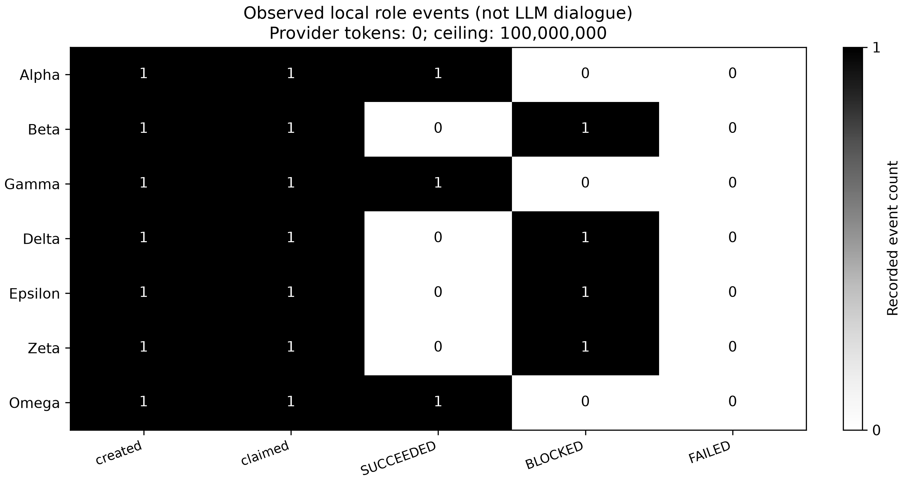
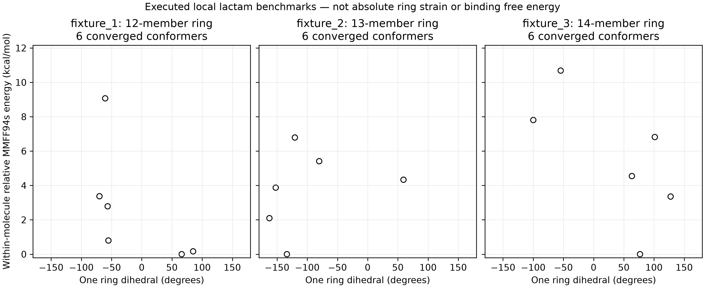

# Phase31｜高张力大环分子胶 QM/MM–FEP 蜂群探索：技术规格与可审计骨架

**交付级别：可执行软件骨架 + 本地 MMFF 构象试验；不是已完成的分子胶发现或生产级 QM/MM–FEP。**

选定参考体系：**人 BRD4 BD2–VHL（保留 Elongin B/C）/ macroPROTAC-1，PDB 6SIS**。这是宏环双功能 PROTAC 基线，不冒充单价分子胶或共价降解剂。原始结构分辨率 3.5 Å，需独立完成结构准备。[结构来源](https://www.rcsb.org/structure/6SIS)

## 从哪里看

- [完整技术规格与科学边界](reports/phase31_scientific_full.md)
- [实际运行摘要](reports/local_validation.md)
- [结构原始文件、检索时间与 SHA256](results/reference/provenance.json)
- [实际本地试验与可移植事件快照](results/local_pilot/)
- [七角色提示词](swarm/prompts/) / [预算与租约账本](swarm/memory_ledger.py)
- [回归测试](tests/test_phase31.py)

## 已实现与未实现

| 项目 | 当前状态 |
|---|---|
| 七角色 DAG、同机多进程任务领取、过期租约隔离、恢复校验 | 已实现并测试；不是跨节点集群 |
| 1 亿 Token 全局上限、分角色额度、真实回执去重 | 已实现并测试；无自动 LLM 调用，无最低消费 |
| ETKDGv3 + MMFF94s 构象 | 本地执行；3 个手性大环内酰胺软件样例，不是靶向先导 |
| PySCF 单点/优化、CAS/NEVPT2、ASE CI-NEB | 可检查的适配代码；本次未执行实际 QM/NEB |
| 原始 ωB97X-D/def2-TZVP | 阻断，不偷换成 ωB97X-D3/D4 |
| QM/MM、OpenMM–PLUMED、FEP/REST2、IRC | 输入契约、分析函数或显式阻断接口；生产驱动未实现 |
| 合成路线、协同效应、泛素化、实验活性 | 无本项目新证据，不生成伪造先导 |
| 三维自由能面 | 无采样，不生成 |

## 命令

在仓库根目录、已有含 RDKit/NumPy/SciPy/Matplotlib 的解释器中执行：

```powershell
python projects/phase31/run.py --preflight
python projects/phase31/run.py --self-test
python tools/run_phase.py 31 --workspace work/runs/phase31-new -- --mode local-pilot
python projects/phase31/run.py --out work/runs/phase31-new --resume
```

默认 `--mode plan` 不做构象计算；`local-pilot` 每个样例尝试 6 个构象，单线程。所有执行要求**新输出目录**；同目录重用只能 `--resume`。源码/提示词/已引用结构文件改变会阻止恢复；新建工作区而不是混合证据。

同机并行调度（先准备，两个终端各运行 worker，再手动汇总）：

```powershell
python projects/phase31/run.py --mode local-pilot --out work/runs/phase31-workers --prepare-only
python projects/phase31/run.py --out work/runs/phase31-workers --worker
python projects/phase31/run.py --out work/runs/phase31-workers --status
python projects/phase31/run.py --out work/runs/phase31-workers --finalize
```

此任务图只有 7 个粗粒度角色，不会自动提交 50–100 个候选的 HPC 阵列作业。共享 SQLite 必须在同机本地磁盘。生产入口明确返回非零退出码：

```powershell
python projects/phase31/run.py --mode production --out work/runs/phase31-production
```

显式重新获取公开参考数据（**新目录**，需要网络）：

```powershell
python projects/phase31/run.py --fetch-reference work/reference/phase31-new
```

上述参考文件下载不包含蛋白补残基、加氢、质子化、配体参数化或溶剂化。没有写入 API 密钥、安装新环境或启动付费服务。

## 图表





图片文件名沿用需求，标题明确真实物理量。后者**不是绝对环张力图**；不同分子的零点各自归零，不能跨分子排名。

## 严格边界

1 亿 Token 是**预算天花板**，不是完成证明或保证资源；本管线提供方回执为 0，不代表编写它的对话不耗 Token。七角色共识不能取代物理检验。PySCF 的当前原始 ωB97X-D 色散接口限制见[官方源码](https://pyscf.org/_modules/pyscf/scf/dispersion.html)。

本地例子最多说明基础工程链路可运行。要宣称新分子胶，仍需真实体系、可信计算、合成、结合/降解实验及独立复现。
