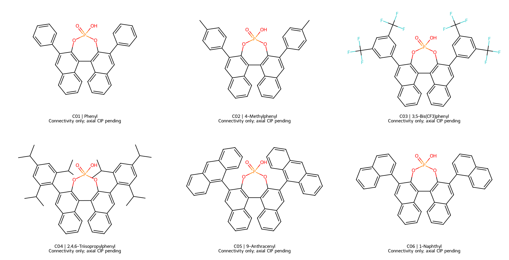

# Phase25–27: evidence, inputs and acceptance status

**阶段性成果；三项科学任务均尚未完成验收。 / Preliminary release; none of the three scientific tasks has passed acceptance.**

**新增真实计算 / New actual calculations:** [中文进展报告](../PHASE25_PROGRESS_ZH.md) · [English progress report](../PHASE25_PROGRESS_EN.md). These supersede the initial Phase25 job counts below: complete 117-atom ternary optimizations/Hessians, audited isolated-imine results in two solvents, a converged DFT geometry and frozen completed gradients from an ongoing native DFT Hessian. [Current frozen counters](phase25/pilot_progress.json) · [Ternary diagnostics](phase25/ternary_diagnostics.json) · [Local execution snapshot](phase25/local_execution_snapshot.json). Running/queued calculations are not accepted results.

| Task | Verified deliverables in this release | Scientific outputs |
|---|---|---|
|25, asymmetric catalysis|6 complete catalyst connectivities with coordinate mirrors; 8 E/Z imine structures; 144 force-field starts; 96-condition grouped split; 10 seeds; isolated-imine DFT single points|Rates/conversion/signed ee unestablished; **选择性未判定**|
|26, constant-potential Cu|48-condition matrix; 3 dry slab seeds; electron/charge/Legendre checks|No sampled solvated interfaces, activation PMFs, currents or FE|
|27, Ni photochemistry|6-member proposed series; 5 original full Ni XYZs; 3 excitation windows; censor-aware analysis|No new multireference trajectories, lifetimes, spectra or branch yields|

## Reports / 技术报告

- **25**: [中文](../PHASE25_REPORT_ZH.md) · [English](../PHASE25_REPORT_EN.md)
- **26**: [中文](../PHASE26_REPORT_ZH.md) · [English](../PHASE26_REPORT_EN.md)
- **27**: [中文](../PHASE27_REPORT_ZH.md) · [English](../PHASE27_REPORT_EN.md)

## Auditable evidence / 核验证据

- [Every user acceptance criterion](acceptance.json) — no missing criterion is silently marked passed.
- [Software and structural validation](software_validation.json) · [full test output](software_tests.log).
- [Raw local DFT ledger](phase25/local_qm_pilot/results.json) · [single-point comparison](phase25/local_qm_pilot/summary.json). Failed and interrupted attempts are retained; these are not catalytic barriers.
- [Catalyst identities](phase25/catalysts.json) · [E/Z identities](phase25/imines.json) · [starting-structure search](phase25/search_audit.json) · [condition/split matrix](phase25/conditions.csv) · [blind-test protocol](phase25/blind_protocol.json).
- [Cu condition matrix](phase26/interface_matrix.csv) · [sampling protocol](phase26/protocol.json) · [dry, unrelaxed slab seed manifest](phase26/dry_slab_seeds/manifest.json).
- [Ni series](phase27/series.json) · [multireference/dynamics protocol](phase27/protocol.json) · [original coordinate provenance](literature_structures/manifest.json).
- [Original-source download hashes](source_downloads.json) · [release SHA-256 manifest](file_manifest.json) · [reproduction commands and implementation limits](../phase25_27/README.md).
- [Analytical precision diagnostics](analytical_precision.json): mathematical sensitivity examples only; not predicted chemical observations.

Coordinate torsion signs and mirrors are provided, but catalyst R_a/S_a and product CIP certification are pending. Force-field optimization hits are not physical degeneracies. Dry slabs are not constant-potential interfaces. Literature XYZs are not newly computed structures. Phase24's synthetic measurement labels have not been imported as experimental validation.

Production execution requires connected electronic-structure/explicit-solvent/multireference-dynamics backends and independently held-out experimental labels. This session has no interface for submitting chemistry jobs to the OpenAI GPUs that run model inference.
